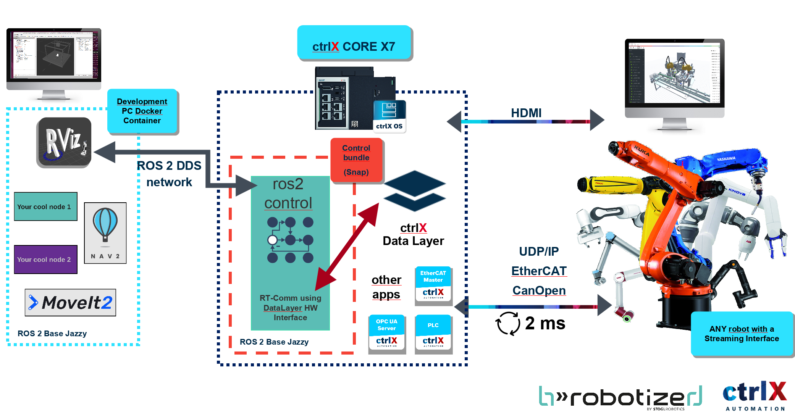

# Package for commisioning and testing of b»Controlled Box

**Your realtime ROS 2 gateway for 24/7 applications!**

b»Controlled Box is a software module for industrial controllers like *CtrlX Core* that enables realtime robot control using ROS 2.

## Table of Contents

- [Compatibility](#compatibility)
- [System Overview](#system-overview)
- [How It Works](#how-it-works-a-typical-data-flow)
- [Troubleshooting](./docs/TROUBLESHOOTING.md)
- [Getting started](#getting-started)

# Compatibility

The following table presents the tested versions of b»Controlled Box with communication layers of industrial controllers and robots.

**CtrlX CORE realtime SDK version: `3.2`**

- `Yes` - the connection is tested in production.
- `Pre` - preliminary tests in the laboratory.
- `TBT` - "To-be-tested"
- `No`  - no support

| b»Ctrld Box version     | ROS 2 distro | CtrlX DataLayer  | KUKA (RSI) | UR   |
|-------------------------|--------------|------------------|------------|------|
| from 3.5.9              | Jazzy        | Yes (ver 3.2)    | Yes (KRC 4)| Yes  |
| from 3.5.9              | Jazzy        | TBT              | Yes (KRC 5)| TBT  |

# System Overview

This system provides a seamless and robust bridge between the high-level **ROS 2** robotics ecosystem and the real-time, deterministic world of **industrial automation**.

By leveraging the **Bosch Rexroth ctrlX AUTOMATION** platform, developers can use powerful ROS 2 tools like MoveIt2 and RViz to control industrial robots which require certified, low-latency communication, combining the best of both worlds for your robotics applications.

The architecture is composed of three main parts: the ROS 2 development environment, the ctrlX CORE industrial controller which acts as a real-time bridge, and the physical industrial robot.

### 1. The Commissioning PC (ROS 2)

This is a standard PC where robotics application development takes place.

* **Operating System:** Runs **ROS 2** (e.g., Jazzy Jellyfish).
* **High-Level Tools:** Developers can use the full suite of ROS 2 packages for advanced tasks, such as:
    * **MoveIt2** for motion planning.
    * **RViz** for 3D visualization and diagnostics.
    * **Custom ROS 2 Nodes** for application-specific logic.
* **Communication:** The PC communicates with the ctrlX CORE via ethernet over a standard **ROS 2 DDS network**.

### 2. The Industrial Bridge (ctrlX CORE)

At the heart of the system is the **ctrlX CORE**, an industrial-grade controller that reliably executes real-time tasks.

* **ctrlX OS:** A Linux-based operating system that allows for the deployment of applications as **Snaps**.

* **ctrlX Data Layer:** A real-time, shared-memory database that acts as the central nervous system for all apps running on the device. It allows different processes to exchange data with deterministic speed.

* **Control Bundle (Snap):** This is our custom application package. It embeds a standard **`ros2_control` controller manager** onto the ctrlX CORE. Its role is to receive high-level commands from the ROS 2 network and dispatch them to **controllers or hardware drivers**

* **Real-Time Hardware Interface:** Inside our bundle, a specialized `ros2_control` hardware driver reads commands from the controller manager and writes them directly into the **ctrlX Data Layer**.

* **Industrial Protocol Apps:** The ctrlX CORE simultaneously runs other certified apps, such as an **EtherCAT Master** or **OPC UA Server**. These apps read data from the Data Layer and manage the low-level, physical communication with the robot.

### 3. The Robot

This is an industrial robot that supports a **real-time streaming interface**.

* **Communication:** The robot is connected to the ctrlX CORE using an industrial fieldbus protocol like **EtherCAT**, **UDP/IP**, or **CANopen**.

* **Execution:** It receives a continuous stream of commands from the ctrlX CORE at a high frequency, ensuring smooth motion.

## How It Works: A Typical Data Flow

Here is the step-by-step journey of a command from your computer to the robot's movement:

1.  **Command Generation:** On the development PC, a tool like MoveIt2 or a custom node publishes a command to a ROS 2 topic.
2.  **Network Transmission:** The command travels over the ROS 2 DDS network to our **Control Bundle** running on the ctrlX CORE.
3.  **Controller Management:** The `ros2_control` controller manager inside the bundle receives the command and forwards it to the appropriate controller
4.  **Data Layer Write:** Our custom hardware interface transports the command (e.g., target joint positions) into the **ctrlX Data Layer** in a real-time-safe context.
5.  **Real-Time Read & Stream:** The **EtherCAT Master** app, running in a deterministic loop, reads these values from the Data Layer.
6.  **Robot Movement:** The EtherCAT Master streams the commands over the physical bus to the robot, which executes the motion precisely. The robot's feedback (actual position, velocity) travels back through the same path.

### Why This Architecture?

This architecture is powerful because it solves a fundamental challenge in modern robotics: combining the rapid innovation of open-source software with the stringent real-time and safety requirements of industrial hardware.

Historically, robotics developers had to choose between the **Robot Operating System (ROS)** and **Industrial PLC Systems**. Each has a distinct set of strengths and weaknesses.

Our hybrid approach allows you to **innovate rapidly** using the vast ROS ecosystem while deploying solutions on **certified, industry-proven hardware**. You get the advanced capabilities of modern robotics without sacrificing the performance and safety that industrial applications demand.

|  | 🤖 ROS Ecosystem                                                                                                   | ⚙️ Industrial Controllers (like ctrlX)                                                                                  |
| ----------------------- | ------------------------------------------------------------------------------------------------------------------ | ----------------------------------------------------------------------------------------------------------------------- |
| **Core Strength** | State-of-the-art algorithms (motion planning, perception), AI/ML integration, physics simulation, and complex data handling. | **Deterministic real-time execution**, certified safety (IEC 61508), long-term availability, and robust hardware.        |
| **Hardware & I/O** | A rich driver ecosystem for cameras, LiDAR, and novel research components.                                         | **Native support for industrial fieldbuses** (EtherCAT, PROFINET, etc.) and a scalable portfolio of sensors and actuators. |
| **Programming** | Uses C++ and Python, providing access to a vast pool of developers and a massive ecosystem of open-source libraries.   | Uses IEC 61131-3 (e.g., Ladder Logic), which is optimized for simple, sequential logic control.                        |
| **Typical Weakness** | Lacks native real-time guarantees, industrial-grade safety certifications, and straightforward deployment pipelines.   | Limited in handling complex scientific data, often involves proprietary interfaces and potential vendor lock-in.         |

# Getting started

Refering to the image above, the setup consists of three main parts:
1. setting up **ctrlX CORE device**
2. setting up **b»Controlled Box development environment**
3. setting up the **Robot itself**

## 1. ctrlX CORE device setup
MOVE TO A SEPARATE FILE, add TROUBLESHOOTING.md
### setup ctrlX UI
we have a default ip: `192.168.28.28`

[guide](https://www.youtube.com/watch?v=75oBQT-tif8)
### setup network
setup network for robot and for ros 

### install an application
pictures of the store
download and upload the thing

### setup licenses - TBA

when we add licenses

## 2. setup the comissioning PC
MOVE TO A SEPARATE FILE add TROUBLESHOOTING.md

this is done:
https://github.com/b-robotized/b_ctrldbox_commissioning/tree/master
https://github.com/b-robotized/b_ctrldbox_commissioning/tree/kuka-master

## 3. setup the robot
MOVE TO SEPARATE FILE add TROUBLESHOOTING.md
KUKA - https://github.com/b-robotized-forks/kuka_experimental/tree/UAS-Karlsruhe/rolling/kuka_rsi_hw_interface/krl/KR_C4
merge - mention https://github.com/b-robotized/b_ctrldbox_commissioning/tree/kuka-master as well? put all docs there?
UR - to be added

https://cloud.b-robotized.com/apps/files/files/318571?dir=/202X%20Internal%20-%20SR%20Control%20Box/31%20-%20KUKA

