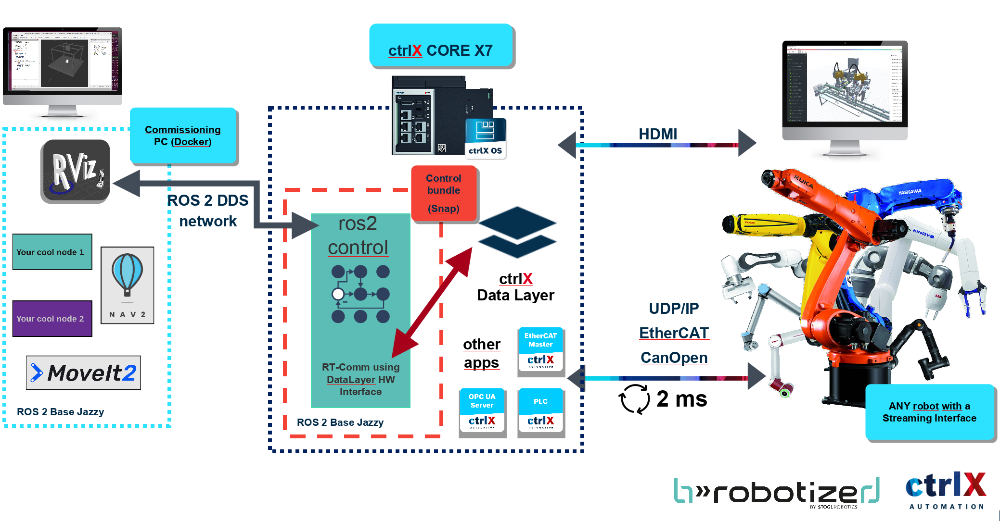

# Package for commisioning and testing of b»Controlled Box

**Your realtime ROS 2 gateway for 24/7 applications!**

**b»Controlled Box** is a software module for industrial controllers like the **Bosch Rexroth ctrlX CORE**, enabling real-time robot control using **ROS 2.** This package contains instructions to set up and commission your system.

## Table of Contents

- [System Overview](#system-overview)
- [Compatibility](#compatibility)
- [Getting started](#getting-started)
- [How It Works](#how-it-works-a-typical-data-flow)

# System Overview

This system provides a seamless and robust bridge between the high-level ROS 2 ecosystem and the real-time world of industrial automation.

By leveraging the **Bosch Rexroth ctrlX AUTOMATION** platform, developers can use standard **ROS 2** tools like MoveIt2 and RViz to control industrial robots that require real-time, low-latency communication. This architecture combines the flexibility of open-source robotics with the reliability of industrial hardware.

The architecture consists of physical devices: the PC with ROS 2 high-level application (without control), the ctrlX CORE industrial controller, and the physical robot.

1. **The PC with ROS 2:** A standard PC for application development using the full suite of ROS 2 packages (MoveIt2, RViz, etc.). It communicates with the ctrlX CORE over a standard ROS 2 DDS network.

2. **The Industrial Bridge (ctrlX CORE):** An industrial-grade controller running ctrlX OS. It uses a real-time Data Layer and our custom Control Bundle (a `ros2_control` controller manager) to translate ROS 2 commands into real-timesignals for the robot.

3. **The Robot:** An industrial robot that supports a real-time streaming interface (e.g., EtherCAT, UDP/IP) and is physically connected to the ctrlX CORE.

# Compatibility

The following table presents the tested versions of b»Controlled Box.

**CtrlX CORE realtime SDK version: `3.2`**

| b»Ctrld Box version     | ROS 2 distro | CtrlX DataLayer  | KUKA (RSI) | UR   |
|-------------------------|--------------|------------------|------------|------|
| from 3.5.9              | Jazzy        | Yes (ver 3.2)    | Yes (KRC 4)| Yes  |
| from 3.5.9              | Jazzy        | Yes (ver 3.2)        | Yes (KRC 5)| TBT  |

- `Yes` - the connection is tested in production.
- `Pre` - preliminary tests in the laboratory.
- `TBT` - "To-be-tested"
- `No`  - no support

# Getting started

Ready to begin? Follow our step-by-step guides to get your system up and running.
The process is divided into three main parts:

1. setting up [**ctrlX CORE device**](docs/SETUP_CTRLX.md)
2. setting up the robot itself - refer to **manufacturer-specific instruction**
     * [**KUKA**](docs/supported_robots/KUKA.md)
     * **UR** - To be added
3. setting up [**b»Controlled Box commissioning environment**](docs/SETUP_COMMMISSIONING.md)

## How It Works: A Typical Data Flow

Here is the step-by-step journey of a command from your computer to the robot's movement on example of EtherCAT communication:

1.  **Command Generation:** On the development PC, a tool like MoveIt2 or a custom node publishes a command to a ROS 2 topic.
2.  **Network Transmission:** The command travels over the ROS 2 DDS network to our **b»controlled box** App running on the ctrlX CORE.
3.  **Controller Management:** The `ros2_control` controller manager inside the b»controlled box receives the command and forwards it to the appropriate controller
4.  **Data Layer Write:** Our custom hardware interface transports the command (e.g., target joint positions) into the **ctrlX Data Layer** in a real-time-safe context.
5.  **Real-Time Read & Stream:** The **EtherCAT Master** app, running in a deterministic loop, reads these values from the Data Layer.
6.  **Robot Movement:** The EtherCAT Master streams the commands over the physical bus to the robot, which executes the motion precisely. The robot's feedback (actual position, velocity) travels back through the same path.
