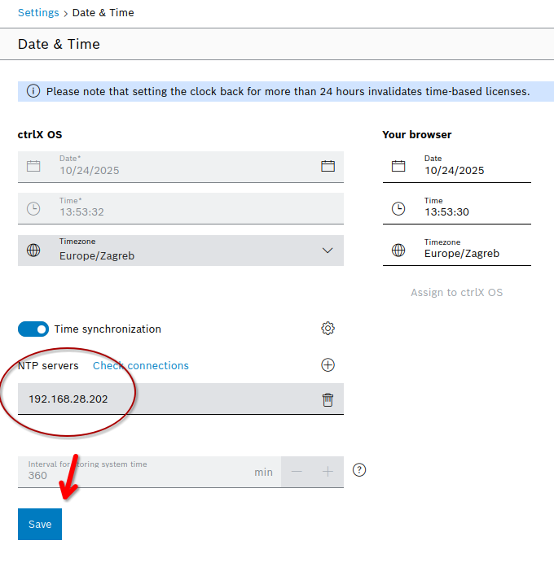

# PC setup with ROS 2

The commissioning PC host runs a Dockerized ROS 2 environment to communicate with the ctrlX CORE.

## 1. Prerequisites

### 1.1 Clone this repository

  ```
  git clone https://github.com/b-robotized/b_ctrldbox_commissioning.git
  cd b_ctrldbox_commissioning
  ```
### 1.2 Install Docker Desktop

  Docker desktop is required to run the container and set up networking via `docker compose` command.
  Refer to [this documentation](https://rtw.b-robotized.com/master/docker/general_information_docker/general_information_docker.html#installation-of-docker) for instructions.

### 1.3 Network Configuration:
  
  Configure a static IP address **on your PC's port** connected to CtrlX XF10 port to `192.168.28.201` with netmask `255.255.255.0`.

  ***IMPORTANT: ROS 2 DDS on the b»controlled box is configured to see only IP addresses `192.168.28.201` (for the dev PC) and `192.168.28.202` (for the commissioning Docker container).***

  #### for example, if these are the default and recommended IPs in the system:

  - **CtrlX CORE:** `192.168.28.28`
  - **ROS2 PC:** `192.168.28.201`
  - **commissioning Docker container:** `192.168.28.202`

  .. then these are `ROS_STATIC_PEERS` env variables:
  - **CtrlX CORE:** `192.168.28.201, 192.168.28.202`
  - **commissioning Docker container:** `192.168.28.28`

  depending on which participant the actor expects to see.

  Verify you can ping the ctrlX controller at its IP address from the docker container.

### 1.4 Set up date-and-time NTP server
To make sure the Date and Time are synchronized between the commissioning container and the CtrlX, navigate to `Settings -> Date and Time` and connect to the NTP server.

***IMPORTANT: The commissioning container must be running for NTP server connection to succeed.***

Enter the IP address of the commissioning container (`192.168.28.202`) and test the connection. If it succeeds, click "Save"



### 1.5 Environment Configuration:

  The repo contains an example `.env` file called `comissionning.env.example` which must be configured with your host information for the container to properly run

  ```
  cp comissioning.env.example commissioning.env
  ```
  * `ROBOT_TYPE`: Set to your robot model (e.g., kuka).

  * `HOST_NETWORK_INTERFACE`: The name of the network interface on your PC connected to the ctrlX device (e.g., `eth0`). Use `ip addr` or `ifconfig` to find it.

  * `CONTAINER_MACVLAN_IP`: The static IP for the Docker container. Set it to `192.168.28.202`.

### 1.6 Make scripts executable:

  Make the `start/enter/stop` bash scripts executable:
  ```
  chmod +x start.sh enter.sh stop.sh
  ```

# 2. Usage

These are the commands for using the container

### 2.1 Start the container: `start.sh`

Upon first start, the container will be downloaded from our container repository. **It will require a login into our container registry!**
#### Registry login:
```
echo "YOUR_REGISTRY_ACCESS_TOKEN" | docker login code.b-robotized.com:5050 -u ctrlx --password-stdin
```
The container also creates the necessary network configuration on the host PC
```
./start.sh
```

### 2.2 Access the container shell: `enter.sh`

To access the container from other terminals, run:
```
./enter.sh
```
When entering the container, the ros environment will automatically be sourced. You can immediatelly run ros2 commands.


### 2.3 Verify container network:

Inside the container, run a quick ping to make sure it can see the ctrlX CORE:

```
ping 192.168.28.28
```

### 2.4 Launch the robot commands

To run scenario commands from the container, refer to `LAUNCH.md` for commands specific to your robot type.

Robot commands for a specific manufacturer can be found in this repo, [on the corresponding branch](https://github.com/b-robotized/b_ctrldbox_commissioning/branches) (e.g. `kuka-master` for [kuka](https://github.com/b-robotized/b_ctrldbox_commissioning/tree/kuka-master))


### 2.5 Stop the container: `stop.sh`

When you are finished, run this command from **host machine**, not the container.
```
./stop.sh
```


# Troubleshooting

TBA