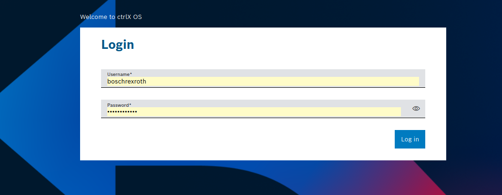
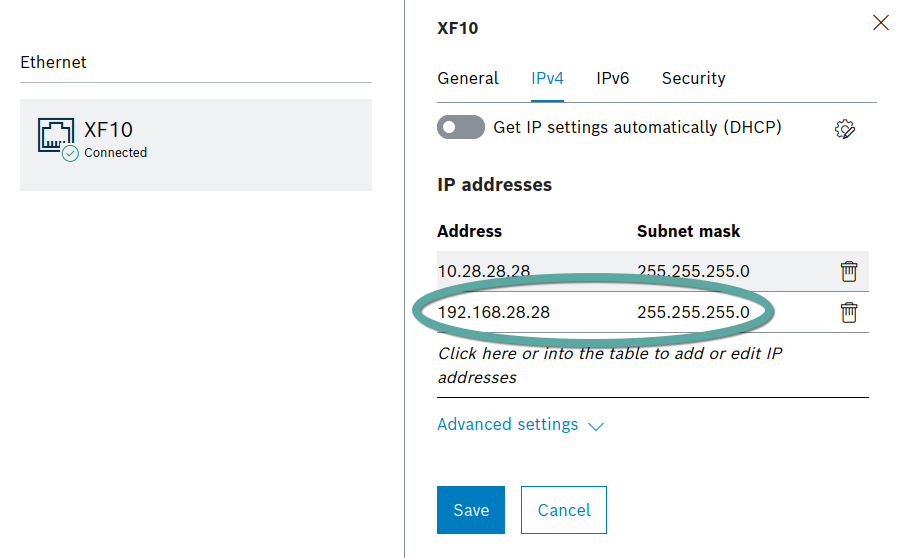
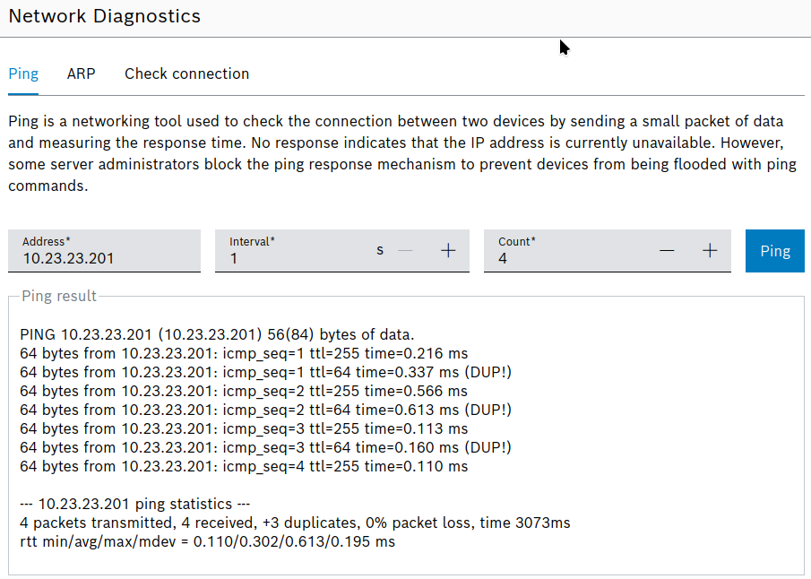
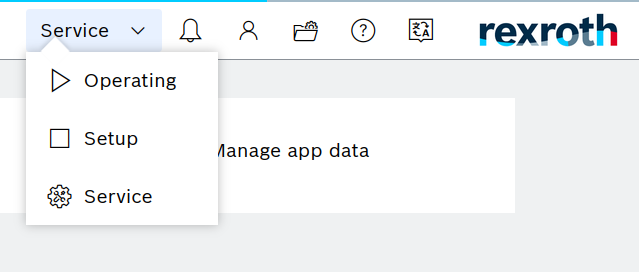
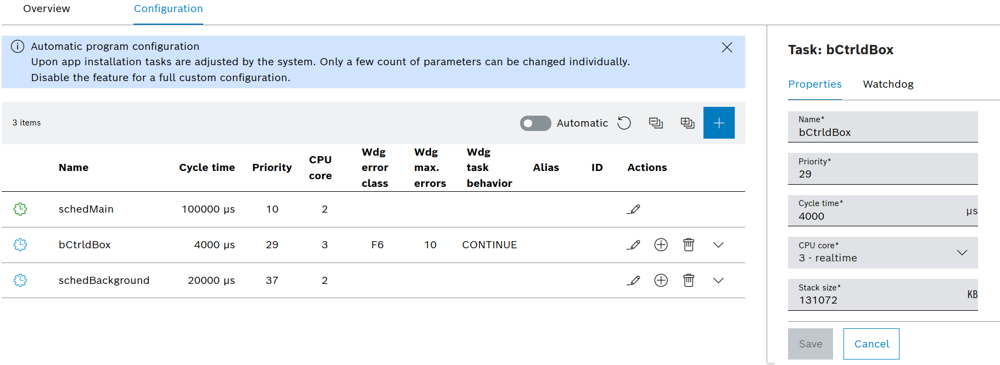

# ctrlX CORE device setup

For help with issues, refer to [Troubleshooting](#troubleshooting) at the end of this file.

## 1. Network Connection

1. Power on the ctrlX CORE device.

2. Connect your PC to the device's commissioning port (typically `XF10`) via an Ethernet cable.

3. **Device from b»robotized** If you have got the device with setup from b»robotized than the following steps are not relevant for you, still you can check them to better understand the configuration. Then check the documentation that you have got with the device for the IP address for ROS and engineering access through XF10 port.

4. **Your device** The device has a default static IP address: `192.168.1.1`. Open a web browser and navigate to this address. You should see the ctrlX CORE login screen.```




Tip: For a general introduction to the ctrlX OS interface, see the official [Rexroth ctrlX OS Getting Started Playlist.](https://www.youtube.com/watch?v=kV8TtBNVecM&list=PLRO3LeFQeLyN8HlLG8VZzgoCLqTUcTPUx)


### 1.1 Configure ROS 2 Network Interface
***IMPORTANT:*** Section is only applicable if you did not get the device directly from b»robotized.

1. In the ctrlX UI, navigate to `Settings > Network Interfaces.`

2. Select the X10 Ethernet port.
3. Go to the `IPv4` tab and add as additional IP address `192.168.28.28` with subnet mask `255.255.255.0`.
4. To validate the connection, navigate to `Settings > Network Diagnostics` and ping your robot.

### 1.2 Configure Robot Network Interface
***IMPORTANT:*** Section is only applicable if you did not get the device directly from b»robotized.

Ensure the robot is powered on and connected. Then:

1. In the ctrlX UI, navigate to `Settings > Network Interfaces.`

2. Select the Ethernet port connected to your robot. (Recommended: `XF12`)
3. Go to the `IPv4` tab and set a static IP address that is on the same subnet as your robot.

Recommened and default address is `10.23.23.28` with subnet mask `255.255.255.0`. _Note that if you got the device from b»robotized, there is a dedicated IP address for it - check the manual for more informations._

### 1.3 Validate connections
To validate either robot or PC connection, navigate to `Settings > Network Diagnostics` and ping your robot.


## 3. Install the b»controlled box App

1. Obtain the b»controlled box Snap application file. If you don't have it, you can find the app [on the b»robotized cloud](https://cloud.b-robotized.com/s/JqT3ZqA8bQbqXz2).

2. Ensure the device is in **SERVICE** mode. This mode allows for app installation but does not provide real-time guarantees.

3. Navigate to `Settings > Apps.`

4. Upload the Snap file and click `Install`. The app will start automatically.

## 4. Understanding Operation Modes

The ctrlX OS has three key modes that manage the lifecycle of real-time applications.

b»Controlled Box controller manager responds to these modes to ensure safe operation. For example, switch **OPERATIONAL** -> **SETUP** will automatically deactivate controllers that send motion commands.



* **SERVICE**: The default mode for system configuration. You can install, update, or remove apps. Real-time execution is disabled.
  * controller manager waits for robot description

* **SETUP**: A real-time guaranteed mode for setting up the robot scenario.
  * all hardware interfaces can be active. Controllers that do not claim command interfaces can be active

* **OPERATIONAL**: The full real-time production mode. 
  * all hardware interfaces and controllers can be active and the system is ready to control the robot.


## 5. Configure the Real-Time Scheduler

**The scheduler** is the heart of the ctrlX CORE's real-time system. It executes tasks from applications, called "callables," on a deterministic, real-time thread. b»Controlled Box ROS 2 controller manager's `read/update/write` loop is executed within such a callable.

You can configure the cycle time of this callable to match your robot's communication and control requirements.

1. Navigate to `Settings -> Scheduler -> Configuration` and select the **Edit** action in the Action column (the pencil icon)
2. Adjust the cycle time and save.



Important: Any changes made to the scheduler settings will only be applied to the control bundle after the device transitions from SERVICE mode to SETUP mode.


## 6. Add app License - TBA

For now, official licensing is to be implemented

# Troubleshooting

### Restarting the ctrlX CORE
To restart the device, navigate to `Settings -> Shutdown` and select **Restart**