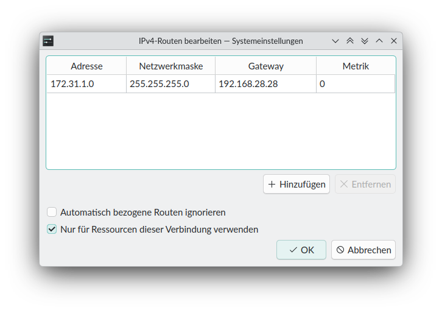

# Engineering Access to the Robot through b»controlled box

This guide explains how to reach the robot's own configuration and
engineering interface (e.g. WorkVisual, smartHMI, iiQWorks.Sim, or the
manufacturer's equivalent) from your engineering PC when the robot is
connected through **b»controlled box**.

## 1. Why you can't connect directly

Your engineering PC is not on the same network as the robot. It connects to
the ctrlX CORE's commissioning port (`XF10`, `192.168.28.0/24`), and the
robot is on its own separate network on a different ctrlX port (e.g.
`XF12`). Traffic between the two is forwarded by the ctrlX CORE's
**Firewall App** — you never connect your engineering PC directly to the
robot's network.

## 2. Choose an IP address for your engineering PC

Assign your engineering PC a static IP in the `192.168.28.0/24` range on
the interface connected to `XF10`. Avoid these reserved addresses:

| Address           | Reserved for                                                                                     |
| ------------------ | ------------------------------------------------------------------------------------------------- |
| `192.168.28.7`     | ctrlX CORE device default (see [SETUP_COMMMISSIONING.md](SETUP_COMMMISSIONING.md))                |
| `192.168.28.28`    | zenoh router / ROS 2 middleware (see [SETUP_CTRLX.md](SETUP_CTRLX.md), [SETUP_ZENOH.md](SETUP_ZENOH.md)) |
| `192.168.28.201`   | dev/ROS 2 PC — typically also runs the NTP server, see [SETUP_NTP_SERVER.md](SETUP_NTP_SERVER.md) |
| `192.168.28.202`   | commissioning Docker container (see [SETUP_COMMMISSIONING.md](SETUP_COMMMISSIONING.md))           |

Any other address in that range is free to use.

## 3. Add a route to the robot's network

Being on `192.168.28.0/24` only gets you to the ctrlX CORE — it doesn't
automatically route you to the robot's own network. Your engineering PC
needs an additional static route that sends traffic for the robot's
network through the ctrlX CORE (`192.168.28.28`) as gateway.

Example — reaching a robot-side network of `172.31.1.0/24` (use your
project's actual robot network address, this varies per project):

| Field                                          | Value             |
| ----------------------------------------------- | ----------------- |
| Address                                          | `172.31.1.0`       |
| Netmask                                          | `255.255.255.0`    |
| Gateway                                          | `192.168.28.28`    |
| Metric                                           | `0`                |
| "Use only for resources on this connection"      | checked            |

*Adding the static route in a connection's IPv4 settings (Linux/NetworkManager example).*

**Linux**: straightforward — add the route in the connection editor's IPv4
"Routes" dialog, as shown above.

**Windows**: not yet verified for a native install. If you're on Windows,
we recommend running a Linux VM and setting the route there instead.

## 4. Configure the forwarding rule on the ctrlX CORE (Firewall App)

The route above only tells your PC *how* to send the traffic — the ctrlX
CORE still needs a rule in its **Firewall App** (`Settings > Apps >
Firewall`) that actually forwards traffic between the commissioning
interface (`XF10`) and the robot interface (e.g. `XF12`) for the network
your engineering tool needs to reach.

We don't reproduce the Firewall App's setup steps here — follow Bosch
Rexroth's own guides for the exact walkthrough:

- [ctrlX OS – Firewall (app store overview)](https://community.boschrexroth.com/ctrlx-os-store-apps-oc2pqqwn/post/ctrlx-os---firewall-jgX6YwqQvfSqREq)
- [Firewall Basic – a practical guide](https://community.boschrexroth.com/ctrlx-automation-how-tos-qmglrz33/post/firewall-basic-a-practical-guide-AgD0zC85SLtq6VU)

In short: add a routing rule that permits/forwards traffic between `XF10`
and the robot-facing interface, scoped to the robot's network and the
ports your engineering tool needs (e.g. the manufacturer's UI/config
port).
