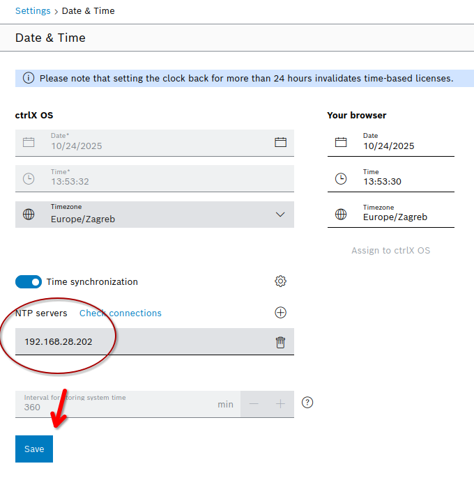

## NTP Server Setup & Commissioning

This section covers configuring the NTP server inside the commissioning Docker container. The goal is to make sure the CtrlX CORE and other local clients can sync their time with the commissioning environment.

### 1. Overview

We are running **`chrony`** inside the container. It handles two specific jobs:

* **Syncs itself:** Pulls time from internet sources (Ubuntu pools) to keep the container and host kernel accurate.
* **Serves time:** Acts as the time source for the local CtrlX subnet (`192.168.28.0/24`).

### 2. Container Configuration (Server Side)

For the NTP service to work, three specific components need to be set up in the Docker stack.

1.  **Installation & Access Control**
    Standard `chrony` install. By default, Chrony acts only as a client. We have to explicitly tell it to allow queries from the local subnet.

    *In the container:*
    ```bash
    # Check for chrony installation
    sudo apt update && sudo apt install -y chrony

    # Check if the config exists, if chrony is installed
    tail /etc/chrony/chrony.conf

    # If it does not, run this to allow connections from the 192.168.28.x subnet
    # Appends the "allow" directive to chrony.conf.
    echo "allow 192.168.28.0/24" >> /etc/chrony/chrony.conf
    sudo systemctl restart chronyd
    sudo systemctl enable chronyd
    ```

2.  **Kernel Clock Capabilities (`docker-compose.yml`)**
    Standard containers can't adjust the system clock. We have to grant the `SYS_TIME` capability so Chrony can manage the kernel time frequency.

    *From docker-compose.yml:*
    ```yaml
    cap_add:
      - SYS_TIME
    ```

3.  **Static IP Networking (docker-compose.yml)**
    We use a `macvlan` network driver. This assigns a distinct MAC address and a static IP (`192.168.28.202`) to the container, making it appear as a physical device on the network. This bypasses the host's NAT, allowing the CtrlX device to reach the NTP server directly on standard port 123.

    *From docker-compose.yml:*
    ```yaml
    networks:
      ctrlx_macvtap:
        ipv4_address: ${CONTAINER_MACVLAN_IP} # e.g., 192.168.28.202
    ```

### 3. Host Firewall Verification

Because the container uses `macvlan`, it bypasses many of the host's default firewall rules. However, it is good practice to ensure the host machine allows UDP traffic on port 123, especially if bridge networks are involved in debugging.

To check the firewall status on the Ubuntu Host:
```bash
sudo ufw status verbose
```

If `active`, we need to allow NTP port on UDP
```bash
sudo ufw allow 123/udp
```

### 4. Validation and testing

Macvlan details: due to host network being isolated from the container, the Host PC cannot talk to the Container's Macvlan IP.

- Tests run from the Host PC will fail (timeout or "No suitable source").
- Run external checks from a different device (laptop or CtrlX) or check internally.

#### Step 1: Internal server check (in container)
```bash
chronyc tracking
```
We're looking for something like this:
```
Reference ID    : B99C6EB7 (vm3750086.example.com)
Stratum         : 3
Ref time (UTC)  : Wed Feb 04 11:19:54 2026
System time     : 0.000115322 seconds slow of NTP time
Last offset     : -0.000264691 seconds
RMS offset      : 0.002278345 seconds
Frequency       : 34.803 ppm fast
Residual freq   : -0.131 ppm
Skew            : 8.007 ppm
Root delay      : 0.004961213 seconds
Root dispersion : 0.001654768 seconds
Update interval : 64.6 seconds
Leap status     : Normal
```

#### Step 2: External connectivity check (from a device in `192.168.28.x` subnet)
```bash
# -z: Scan, -v: Verbose, -u: UDP
nc -z -v -u 192.168.28.202 123
```
We're looking for something like this:
```bash
Connection to 192.168.28.202 123 port [udp/ntp] succeeded!
```

#### Step 3: Verify NTP response (from a device in `192.168.28.x` subnet)
```bash
# -Q: Query only
chronyd -Q "server 192.168.28.202 iburst"
```
We're looking for something like this:
```bash
2024-05-20T10:00:00Z System clock wrong by 0.000034 seconds (ignored)
```

#### Step 3: Connect CtrlX NTP server
Enter the IP address of the commissioning container (`192.168.28.202`) and test the connection. If it succeeds, click "Save"



## 5. Troubleshoot

| Issue | Possible Cause | Solution |
| :--- | :--- | :--- |
| "No suitable source" (Host) | Macvlan Isolation | Don't test from the Host PC. Use a separate device or test inside the container. |
| "No suitable source" (External) | Server Unsynced | Run `chronyc tracking` inside the container. If Stratum is 0, check container internet. |
| Connection Refused | Container down | Make sure `docker-compose up` is running. |
| Timeout (No Route) | IP Misconfig | Check that `CONTAINER_MACVLAN_IP` matches the subnet. |