# Franka Robot Setup

To control the Franka Robot with b»controlled box — unclear, please confirm intended wording, follow the steps below.

1. Log in to the Franka Desk Web UI at [https://10.50.50.1](https://10.50.50.1).
   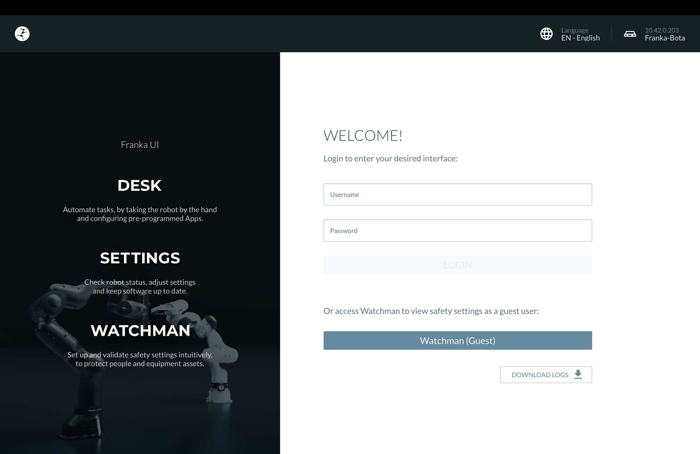

2. Enter your credentials to log in.
   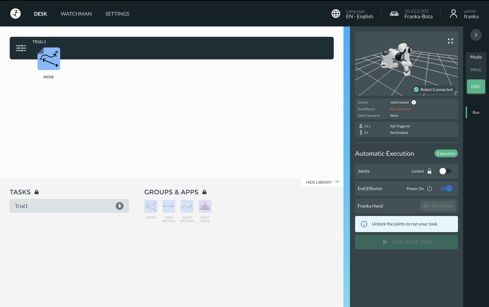

3. On the **Desk** tab, select **Exec** mode.
   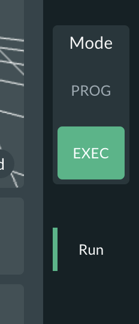

4. Toggle the **Unlock** switch and click **Confirm**. Unlocking takes a moment.
   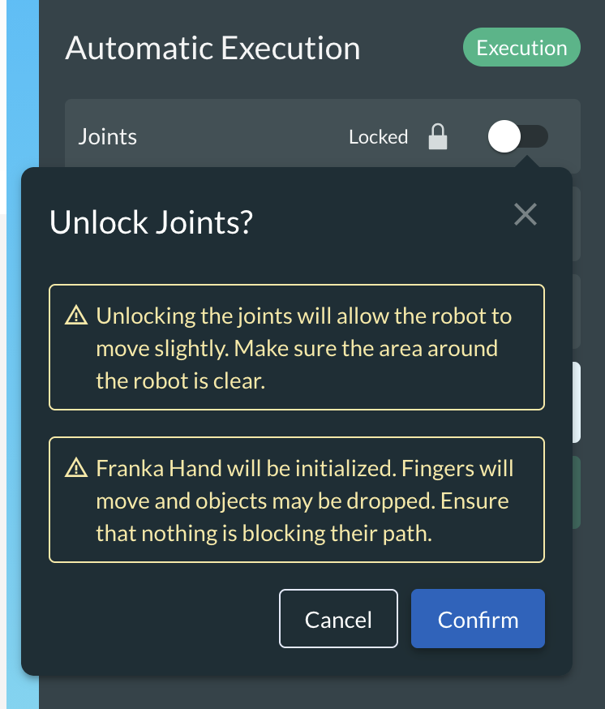
   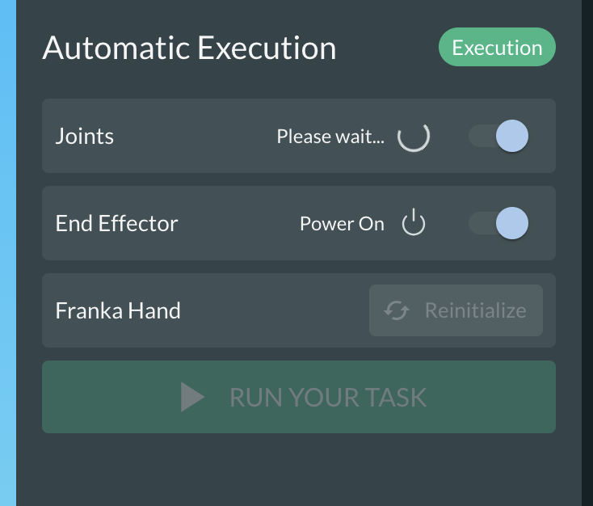

5. Once the joints are unlocked, select your robot's name — e.g., **Franka-Bota** — in the top-right corner.
   

6. Click **Activate FCI**.
   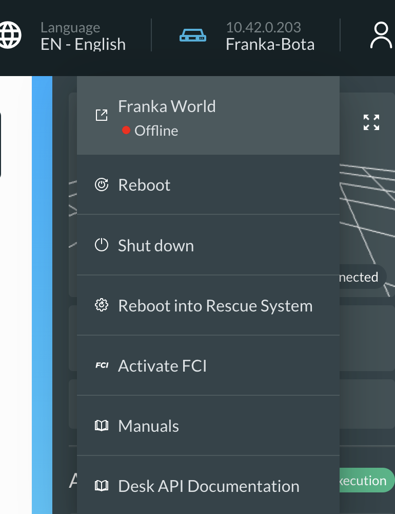

7. A confirmation pop-up will appear. Confirm to activate FCI.
   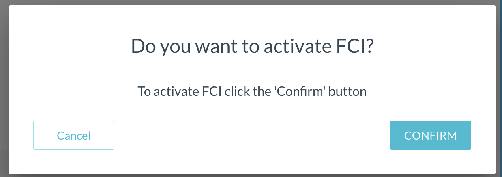

8. Once FCI is active, the dashboard will look like this:
   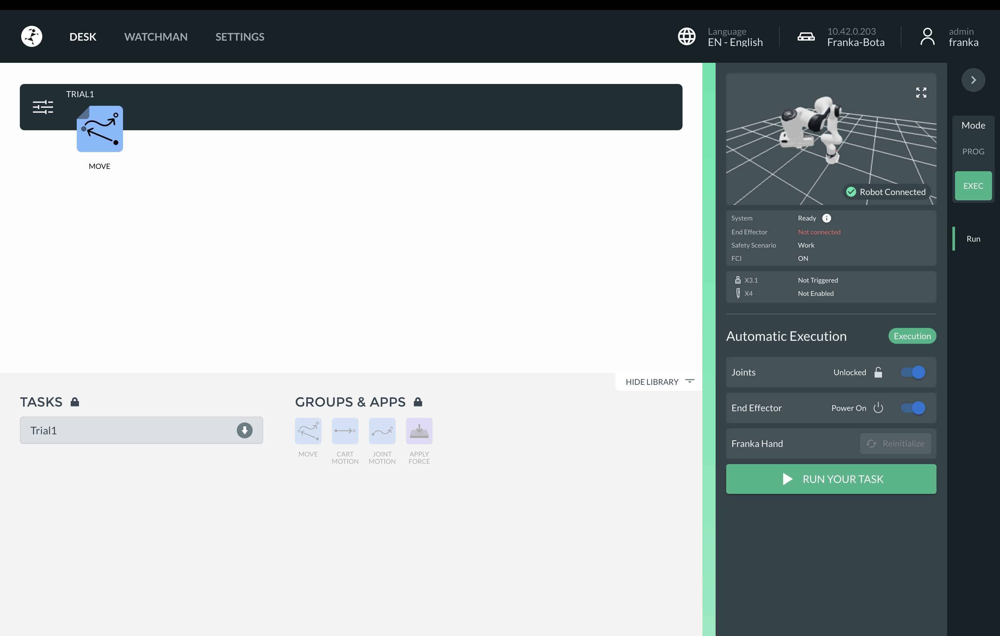

9. To deactivate FCI, select the robot name from the top-right corner and click **Deactivate FCI**.
   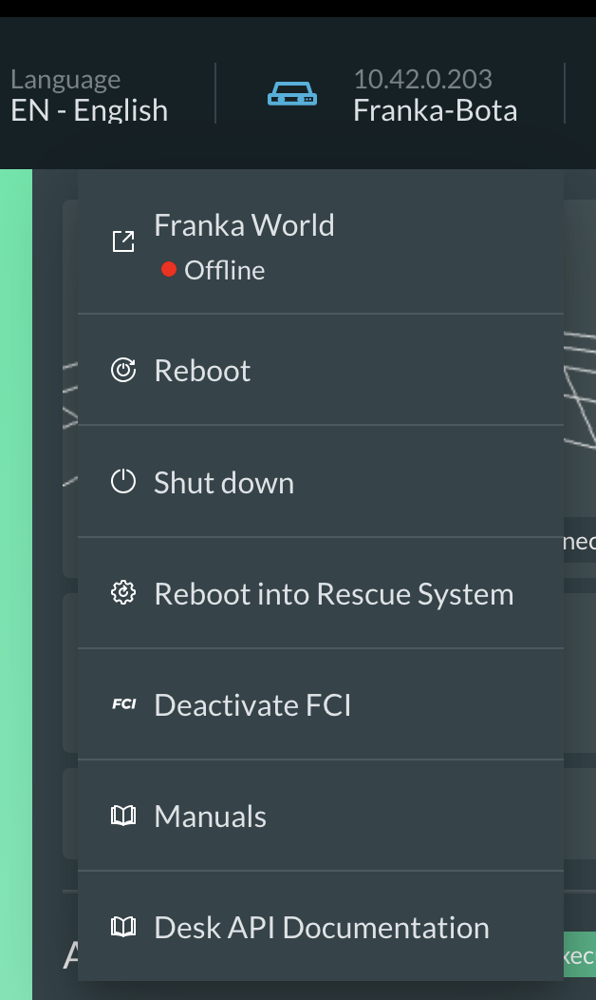

> [!NOTE]
> A ROS 2 lifecycle node is also available for locking/unlocking the Franka robot without using the Desk Web UI. Commands are listed below.

#### Commands for ROS 2 Lifecycle Node

```bash
# Start the ROS 2 lifecycle node
ros2 launch franka_lock_unlock franka_lock_unlock.launch.xml hostname:=<hostname> username:=<username> password:=<pwd>

# Configure the node (takes ~2 minutes — it runs a self-test)
ros2 lifecycle set /franka_lock_unlock_node configure

# Activate (unlocks the robot and enables FCI)
ros2 lifecycle set /franka_lock_unlock_node activate

# Deactivate (locks the robot)
ros2 lifecycle set /franka_lock_unlock_node deactivate

# Clean up
ros2 lifecycle set /franka_lock_unlock_node cleanup

# Shut down
ros2 lifecycle set /franka_lock_unlock_node shutdown
```

## Next Steps

The Franka robot is now unlocked and ready to use. Proceed to [Commissioning PC Setup](../SETUP_COMMMISSIONING.md) to launch the ROS 2 environment and start controlling the robot.

## Troubleshooting

### Emergency Stop

When the emergency stop button is pressed, the Franka robot locks and its hardware interface enters an unconfigured state. Related controllers — such as the Franka joint trajectory controller and joint state publisher — also become inactive. To recover:

1. **Unlock and reactivate FCI.**
   - If you're not using the ROS 2 lifecycle node: open the Franka Desk Web UI, go to Exec mode, toggle **Unlock**, and wait for the robot to unlock. Then activate FCI (Franka Control Interface).
   - If you're using the Franka Lock/Unlock lifecycle node, run:
     ```bash
     # Deactivate (locks the robot)
     ros2 lifecycle set /franka_lock_unlock_node deactivate

     # Activate (unlocks the robot and enables FCI)
     ros2 lifecycle set /franka_lock_unlock_node activate
     ```

2. **Cycle the Foreman-managed controllers** between inactive and active states:
   ```bash
   ros2 service call /foreman/set_goal foreman_msgs/srv/SetGoal "{goal: 'inactive'}"
   ros2 service call /foreman/set_goal foreman_msgs/srv/SetGoal "{goal: 'active'}"
   ```

3. The robot is now ready for normal use.

### Franka Self-Test

The Franka robot must complete a self-test at least once every 24 hours. If it hasn't, the robot will remain locked until you acknowledge and run the self-test.

To resolve this:

1. Open the Franka Desk Web UI and click **Acknowledge and Execute**, then wait for the self-test to run.
   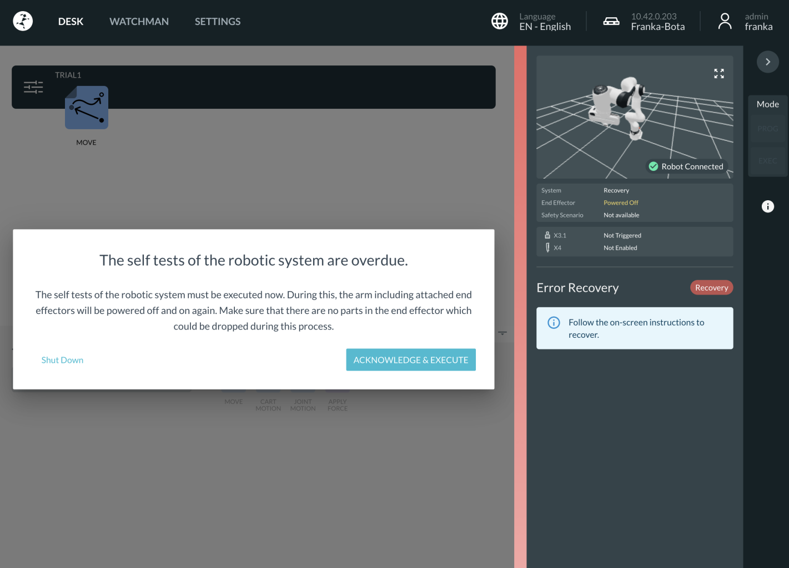
2. The Franka will reboot and run its self-test. Wait about 2 minutes before using it again.
   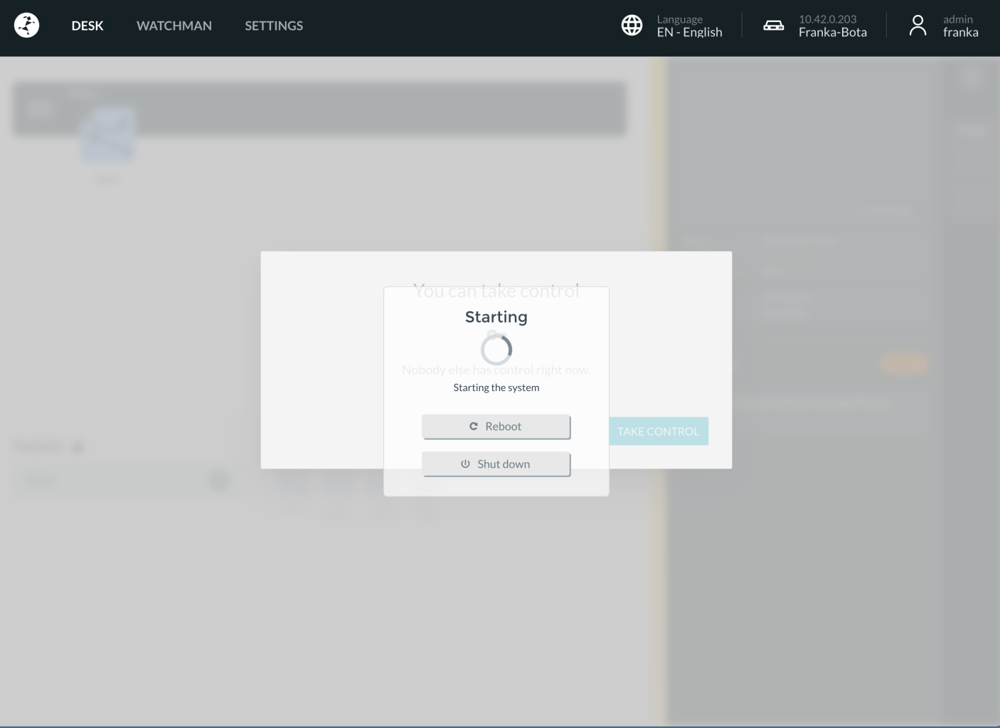
3. Once complete, follow the standard steps above to unlock the robot and activate FCI.

> [!NOTE]
> If you're using the Franka Lock/Unlock lifecycle node, you don't need to do this manually — it includes a built-in timer that runs the self-test automatically within each 24-hour window.

After unlocking the robot, cycle the controllers and hardware interface via Foreman:

```bash
ros2 service call /foreman/set_goal foreman_msgs/srv/SetGoal "{goal: 'inactive'}"
ros2 service call /foreman/set_goal foreman_msgs/srv/SetGoal "{goal: 'active'}"
```

### Franka Gets Locked

If the Franka robot becomes locked, its hardware interface reverts to unconfigured and its ROS 2 controllers become inactive. To recover:

1. If you're not using the Franka Lock/Unlock lifecycle node, open the Franka Desk Web UI, unlock the robot manually, and reactivate FCI (see the setup steps above).
2. Run the Foreman commands to bring the state from inactive back to active:
   ```bash
   ros2 service call /foreman/set_goal foreman_msgs/srv/SetGoal "{goal: 'inactive'}"
   ros2 service call /foreman/set_goal foreman_msgs/srv/SetGoal "{goal: 'active'}"
   ```

### Franka Web UI Multi-User Access
 
The Franka Desk Web UI does not support simultaneous control by multiple users — only one user can control the robot at a time.
 
If you want to switch control to the ROS 2 lifecycle node, go to **Admin** and click **Release**. This releases your control, after which the robot can be controlled by another user or by the ROS 2 lifecycle node.
 
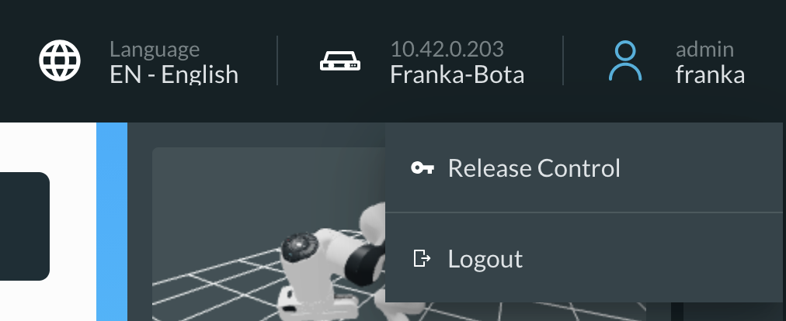
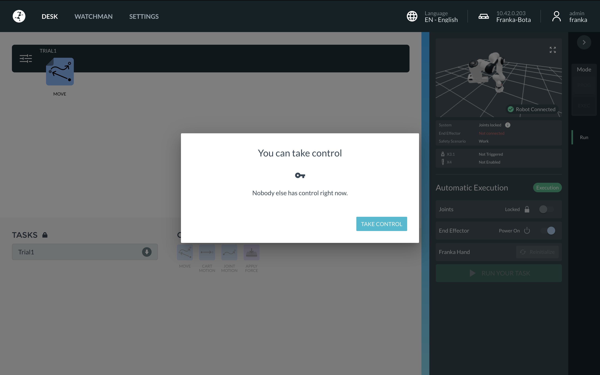
 
If you're not sure who currently has control, you can request access instead. The user currently connected to the Franka Web UI will get a pop-up prompting them to grant you access; once they approve it, you can take control.
 
Alternatively, you can use the **force** option: physically press the button on the Franka robot to gain access to the dashboard.
