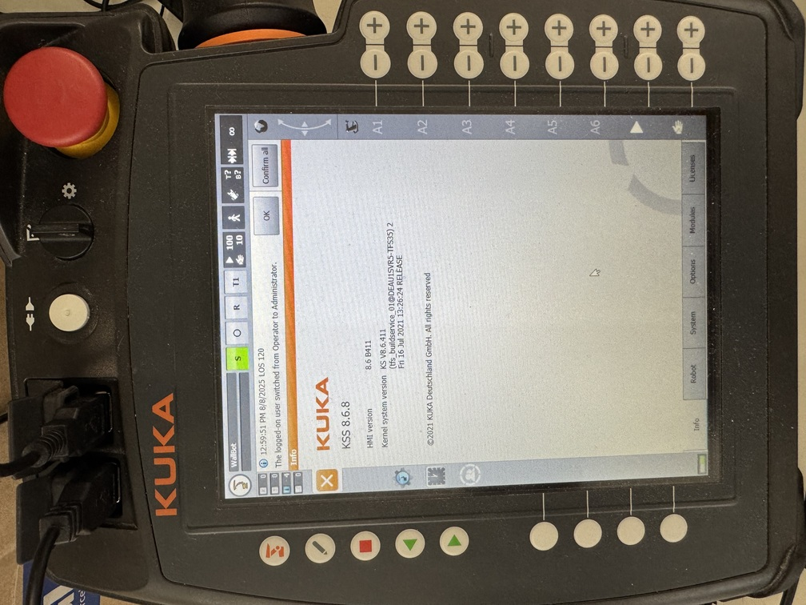
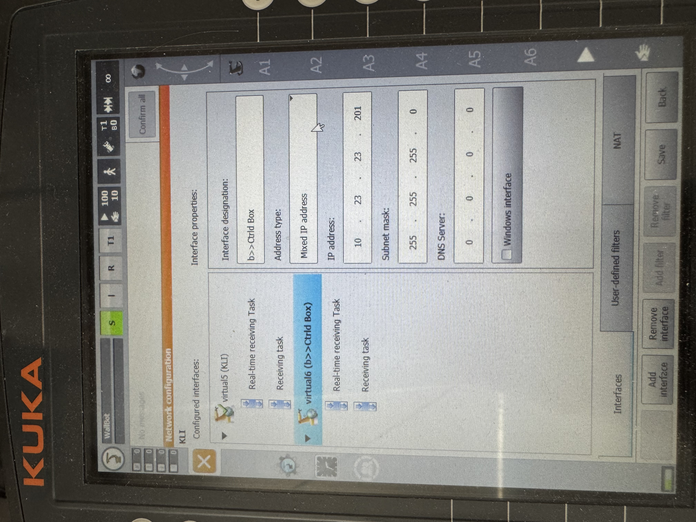
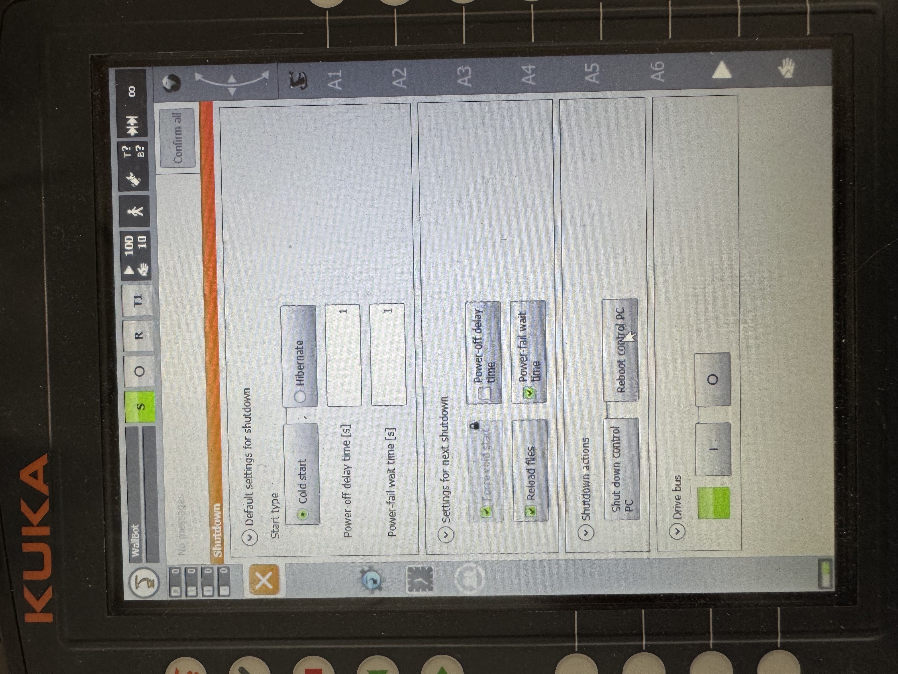
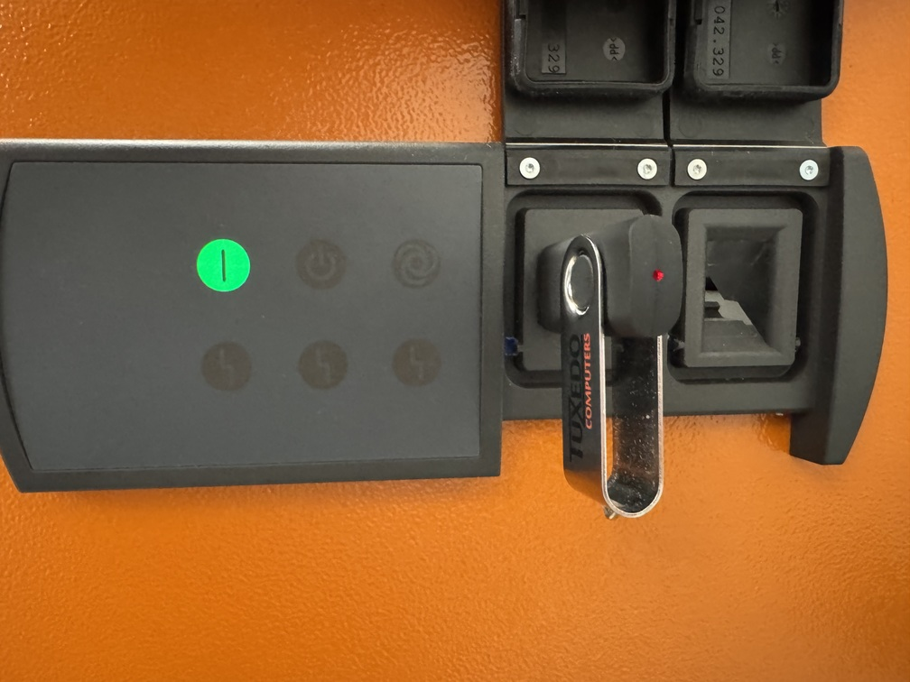
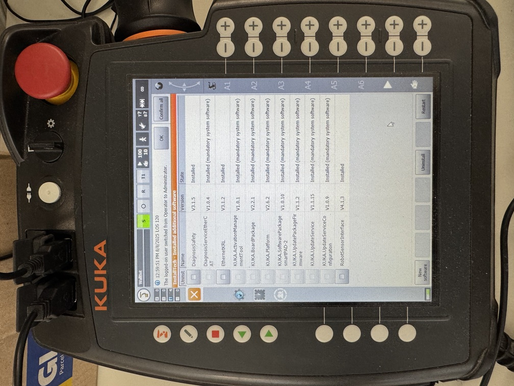

# KUKA Robot Setup

This guide covers the KUKA-specific steps for configuring the Robot Sensor Interface (RSI). This configuration is essential for enabling real-time communication between the robot controller and the b»Controlled Box

## 1. Configure the RSI Network Interface

You'll need to set up a dedicated network interface on the robot controller for RSI communication. 

SmartHMI on the teach pad runs ontop of Windows. Ensure that the Windows interface of the controller is connected to the same subnet as the configuration PC (e.g. `192.168.28.x`).

Log in as **Expert** or **Administrator** on the teach pad and navigate to **Network configuration** (`Start-up -> Network configuration -> Activate advanced configuration`).
There should already exist an interface named Windows interface. For example:
* IP: `192.168.28.210`
* Subnet mask: `255.255.255.0`
* Default gateway: `192.168.28.254`
* Windows interface checkbox should be checked.

From here, the process varies slightly based on your KUKA System Software (KSS) version.

<p align="center">

</p>

### For KSS >= 8.6 (KRC5):

1. On the teach pendant, navigate to `Start-up > Network configuration -> Add interface`.

2. Select the new entry and configure the following:

  * **Interface name:** b>>ctrld box (or similar).

  * **Address type:** Select Mixed IP address. This automatically creates the necessary real-time receive tasks.

  * **IP address**: Assign a static IP on a new subnet. For example `10.23.23.201` - default b»controlled box real-time interface [is configured for `10.23.23.28`](https://github.com/b-robotized/b_ctrldbox_commissioning/blob/575718f718cc3ad3302c491e38694cbc44a09ad0/kuka-master/KRC5/b_ctrldbox_rsi_eth.xml#L3)).

  * **Subnet mask:** `255.255.255.0.`

<p align="center">

</p>

### For KSS < 8.6 (KRC4):

1. Log in as **Expert** and minimize the **HMI** (`Start-up > Service > Minimize HMI`) to access the Windows environment.

2. From the Windows Start Menu, run the **RSI-Network** utility.
  * Verify that the `Network -> Kuka User Interface` shows the **Windows interface** with the specified IP address.

3. Under "`RSI Ethernet`," select **New** and press **Edit**.

4. Enter a static IP address for the RSI ethernet. For example `10.23.23.201` - default b»controlled box real-time interface [is configured for `10.23.23.28`](https://github.com/b-robotized/b_ctrldbox_commissioning/blob/kuka-master/kuka/KRC4/b_ctrldbox_eth.xml#L3).

5. Close the utility and maximize the HMI.

### Perform a Cold Reboot

For the network changes to take effect, a **cold reboot** is mandatory. Navigate to Shutdown, check the boxes for **Force cold start** and **Reload files**, and then press **Reboot control PC.**

<p align="center">

</p>

## 2. Prepare KRL Configuration Files

The **Kuka Robot Language** programs define the communication parameters. You must modify them to match your network setup before transferring them to the controller.
**If you are using recommended IPs, you don't have to edit these files.**

They can be found in the [kuka branch of `b_ctrldbox_commissioning`](https://github.com/b-robotized/b_ctrldbox_commissioning/tree/kuka-master) repository, and are present in the commissioning Docker Container under `~/commissioning/ros2_jazzy/src/b_ctrldbox_commissioning/kuka`

- `b_ctrldbox_rsi_eth.xml:`

  - Edit the default IP `10.23.23.28` to match the IP address of the IP address of the real-time interface for Robot on the CtrlX device.

- `b_ctrldbox_rsi.rsix:`

  - This file contains safety limits. The default values are typically sufficient to start.

  - Pay attention to the `<Timeout>` parameter under `ETHERNET` object. RSI operates in discrete time steps (e.g., 4ms), and the controller expects a valid response from the PC for each step. If you experience frequent disconnects, you may need to adjust properly the scheduler rate in for the b»controlled box in the CtrlX. See [CtrlX setup](../SETUP_CTRLX.md) for more details.

- `b_ctrldbox_rsi.src:`

  - This file defines the robot's starting position. Adjust if necessary.

## 3. Transfer Files to Robot Controller

1. Copy the modified files to a USB drive.

2. Log in as Expert on the teach pendant.

3. Copy the files to the following directories:

  * b_ctrldbox_rsi.src -> `KRC:\R1\Program\`

  * All other files (`.xml`, `.rsix`) -> `C:\KRC\ROBOTER\Config\User\Common\SensorInterface\`

<p align="center">

</p>

## 4. Verify network connection

Before proceeding, confirm that the b»Controlled Box can communicate with the robot's RSI interface.

1. Minimize the SmartHMI (`Start-up > Service > Minimize HMI`).

2. run `cmd.exe` and ping the ctrlX CORE at the real time IP address, e.g.:

```
ping 10.23.23.28
```

3. On the Web UI in CtrlX CORE go to `Settings -> Network Diagnostics` and ping the IP that you have assigned for the newly created interface, e.g. `10.23.23.201`.
**Note**: It is normal and expected to see replies marked as (DUP!). This indicates the RSI network task is active and responding correctly.


## 5. Run the RSI Program

Firstly, ensure `RobotSensorInterface` is listed under `Help > Info > Installed additional software.`

<p align="center">

</p>

Then, activate the RSI program on the robot.

1. On the teach pendant, select **T1 mode**. _This is only for testing, later you can execute the program in the `AUTO` mode._

2. Navigate to the `b_ctrldbox_rsi.src` program and **press the run/play button** while holding an enabling switch. The robot will move to its start position.

3. Press and hold the buttons again. A warning, `!!! Attention - Sensor correction goes active !!!`, will appear.

4. Confirm the warning. The program is now running and attempting to connect to the commissioning PC.

## Next Steps

The KUKA robot is now configured. Proceed to the [Commissioning PC Setup](../SETUP_COMMMISSIONING.md) to launch the ROS 2 environment and start controlling the robot.

# Troubleshooting

`test_joint_trajectory_controller.launch.xml` command fails - if the robot is not in the configured position. *TBA: Show how to reconfigure and rebuild the thing. Mention that in the future versions this will not be an issue.*

### Launch Fails Due to Incorrect Start Position

Problem: The control software fails to connect, often with timeout errors, because the robot is not physically at the start position defined in the KRL program.
Cause: Mismatch between the robot's actual position and the hardcoded PTP coordinates in b_ctrldbox_rsi.src.
Solution:

In T1 mode, jog the robot to a safe, desired starting position.
On the teach pendant, go to Display > Actual position and record the angular values for axes A1 through A6.
Edit the b_ctrldbox_rsi.src file on your PC. Locate the PTP {A1 ..., A2 ..., ...} line and replace the values with the ones you just recorded.
Re-transfer only the modified .src file to KRC:\R1\Program\ on the controller.
Run the program again. The robot will now use this new start position.
  Note: In future versions, this dependency on a hardcoded start position may be relaxed for a more flexible startup procedure.