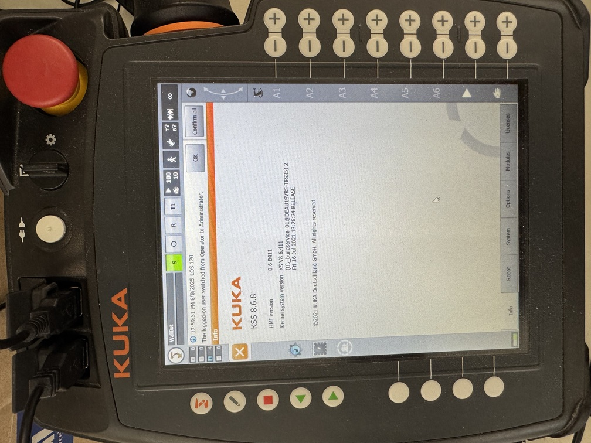
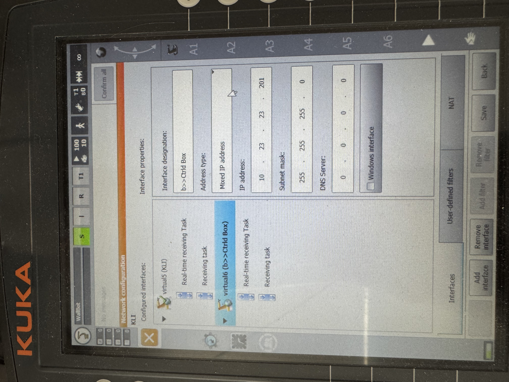
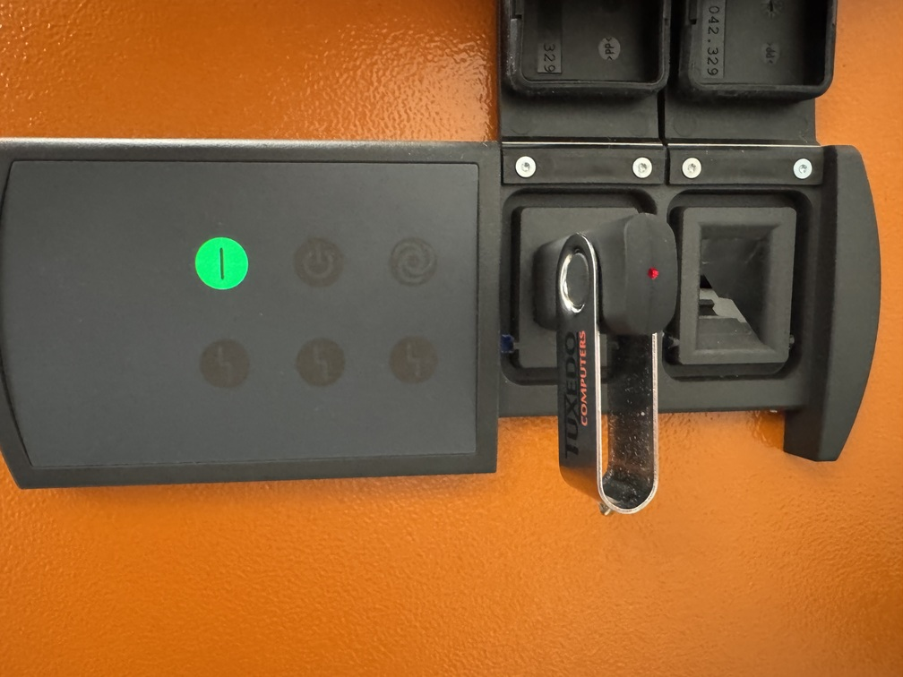
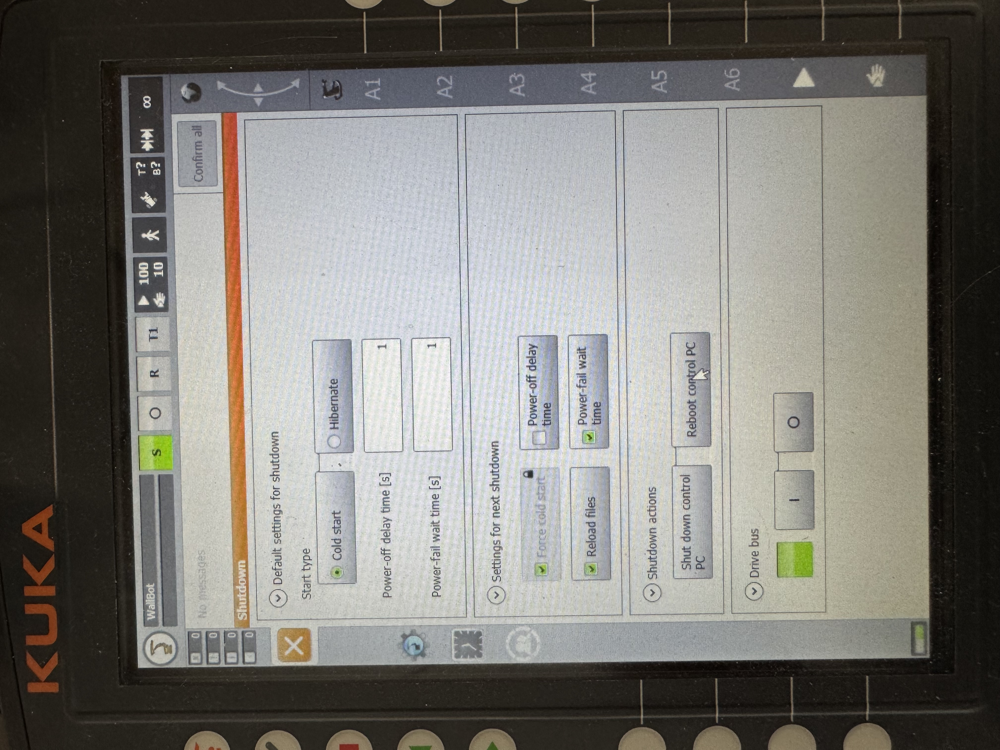
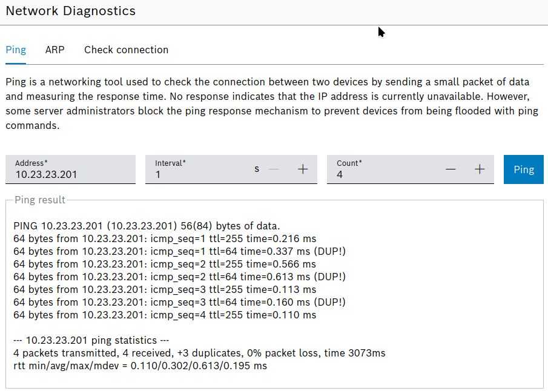
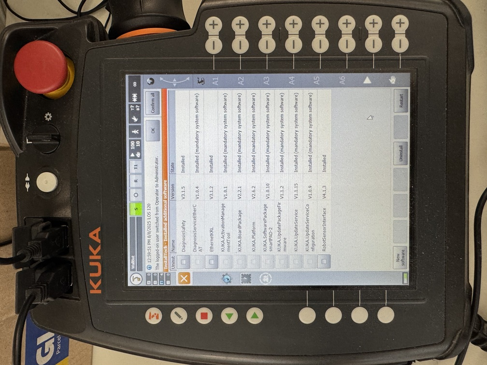

# KUKA Robot Setup

This guide covers the KUKA-specific steps for configuring the Robot Sensor Interface (RSI). This configuration is essential for enabling real-time communication between the robot controller and the b»Controlled Box

## 1. Configure the RSI Network Interface

You'll need to set up a dedicated network interface on the robot controller for RSI communication.

SmartHMI on the teach pad runs ontop of Windows. Ensure that the Windows interface of the controller is connected to the same subnet as the configuration PC (e.g. `192.168.28.x`).

Log in as **Expert** or **Administrator** on the teach pad and navigate to **Network configuration** (`Start-up -> Network configuration -> Activate advanced configuration`).
There should already exist an interface named Windows interface. For example:
* IP: `172.31.1.178`
* Subnet mask: `255.255.255.0`
* Default gateway: `xxx.xxx.xxx.xxx`
* Windows interface checkbox should be checked.

Adjust the IP address too `10.28.23.240` for everything to work out of the box.
If you want to use a different IP, make sure to add an IP in the same range on the X12 interface of the ctrlX CORE device and update the address in `b_ctrldbox_EkiKSSinterface.xml` before the files are copied to the KUKA controller: `workspaces/kuka/kss_deployment/Config/User/Common/EthernetKRL/kss/` for classic KSS (8.x), `.../EthernetKRL/iiqka_os2/` for KSS 9.2.2 (iiQKA.OS2).

<p align="center">

</p>_

1. On the teach pendant, navigate to `Start-up > Network configuration -> Add interface`.

2. Select the new entry and configure the following:

  * **Interface name:** RSI b»ctrld box (or similar).

  * **Address type:** Select Mixed IP address. This automatically creates the necessary real-time receive tasks.

  * **IP address**: Assign a static IP on the same subnet as CtrlX CORE device. For example `10.23.23.201` if the default b»controlled box real-time interface [is configured for `10.23.23.28`](../../workspaces/kuka/kss_deployment/Config/User/Common/SensorInterface/common/b_ctrldbox_rsi_eth.xml).

  * **Subnet mask:** `255.255.255.0.`

<p align="center">

</p>

## 2. Prepare the Configuration Files

All controller-side files are in `workspaces/kuka/kss_deployment/` (also available in the
commissioning Docker container under `~/commissioning/ros2_jazzy/src/b_ctrldbox_commissioning/workspaces/kuka`).
**If you are using the recommended IPs, you don't have to edit any file.**

***IMPORTANT: Pick the RSI version matching the KSS version from Step 1:***

| KSS version | RSI version | Folder |
| :---------- | :---------- | :----- |
| 8.3, 8.4 | RSI 3.3.x | `Config/User/Common/SensorInterface/rsi_3.3.x/` |
| 8.5 | RSI 4.0.x | `Config/User/Common/SensorInterface/rsi_4.0.x/` |
| 8.6 | RSI 4.1.x | `Config/User/Common/SensorInterface/rsi_4.1.x/` |
| 9.2.2 (iiQKA.OS2) | RSI 6.x | `Config/User/Common/SensorInterface/rsi_6.x/` - imported via iiQWorks.Sim, see [`RSI_CONFIGURATIONS.md`](../../workspaces/kuka/kss_deployment/RSI_CONFIGURATIONS.md) |

Each folder contains the configurations Standard, External Axis (`ext_axis/`) and GPIO
(`gpios/`). **Only the RSI 4.1.x contexts match the current ethernet configs** (which also stream
torques, currents, setpoint positions and program status); the other versions still need to be
updated. All configurations share the driver YAML `workspaces/kuka/rsi_xml_config/b_ctrldbox_rsi_xml_config.yaml`. See
[`RSI_CONFIGURATIONS.md`](../../workspaces/kuka/kss_deployment/RSI_CONFIGURATIONS.md) for what
each configuration contains, and [`LAUNCH.md`](../../workspaces/kuka/LAUNCH.md) for how the files
work together.

- `Config/User/Common/SensorInterface/common/<config>/b_ctrldbox_rsi_eth.xml` (ethernet config):

  - Edit the default IP `10.23.23.28` if the real-time interface of the ctrlX CORE uses another address.

- `Config/User/Common/SensorInterface/rsi_<version>/<config>/b_ctrldbox_rsi.rsix` (RSI context):

  - Contains the RSI signal flow and correction limits. The default values are typically sufficient to start.

  - Pay attention to the `Timeout` parameter of the `ETHERNET` object. RSI operates in discrete time steps (e.g., 4ms), and the controller expects a valid response from the PC for each step. If you experience frequent disconnects, you may need to adjust the scheduler rate of the b»controlled box in the ctrlX. See [CtrlX setup](../SETUP_CTRLX.md) for more details.

- `KRC/R1/Program/RSI_kss/rsi_joint_pos_4ms.src` (RSI program, 4 ms; `rsi_joint_pos_12ms.src` for 12 ms):

  - Loads the context `b_ctrldbox_rsi` and starts the sensor-guided motion. It starts from the robot's **current** position (`PTP $AXIS_ACT_MEAS`), so no start position has to be configured.

## 3. Transfer Files to Robot Controller

1. Copy the whole `kss_deployment` folder to a USB drive and plug it into the controller.

2. Log in as Expert on the teach pendant and minimize the SmartHMI (`Start-up > Service > Minimize HMI`).

3. Run `backup.bat` from the `kss_deployment` folder. It saves the current controller files that will be overwritten into `kss_deployment\Backup\<timestamp>\`.

4. Run `deploy.bat`, select the RSI version and the configuration, and confirm each copy step. It copies:

  * ethernet config and RSI context -> `C:\KRC\ROBOTER\Config\User\Common\SensorInterface\`

  * RSI and EKI programs -> `C:\KRC\ROBOTER\KRC\R1\Program\b_ctrldbox\`

  * EKI config -> `C:\KRC\ROBOTER\Config\User\Common\EthernetKRL\`

Manual copy commands for every configuration are listed in [`RSI_CONFIGURATIONS.md`](../../workspaces/kuka/kss_deployment/RSI_CONFIGURATIONS.md) ("Switching Between Configurations").

<p align="center">

</p>

### 4. Perform a Cold Reboot

For the changes to take effect, a **cold reboot** is mandatory. Navigate to Shutdown, check the boxes for **Force cold start** and **Reload files**, and then press **Reboot control PC.**

<p align="center">

</p>

## 5. Verify network connection

Before proceeding, confirm that the b»Controlled Box can communicate with the robot's RSI interface.

1. Minimize the SmartHMI (`Start-up > Service > Minimize HMI`).

2. run `cmd.exe` and ping the ctrlX CORE at the real time IP address, e.g.:

```
ping 10.23.23.28
```

3. On the Web UI in CtrlX CORE go to `Settings -> Network Diagnostics` and ping the IP that you have assigned for the newly created interface, e.g. `10.23.23.201`.
**Note**: It is normal and expected to see replies marked as (DUP!). This indicates the RSI network task is active and responding correctly.



## 6. Run the RSI Program

Firstly, ensure `RobotSensorInterface` is listed under `Help > Info > Installed additional software.`

<p align="center">

</p>

Then, activate the RSI program on the robot.

1. On the teach pendant, select **T1 mode**. _This is only for testing, later you can execute the program in the `AUTO` mode._

2. Navigate to `KRC:\R1\Program\b_ctrldbox\rsi_joint_pos_4ms.src` and **press the run/play button** while holding an enabling switch. The robot moves to its current position (no visible motion).

3. Press and hold the buttons again. A warning, `!!! Attention - Sensor correction goes active !!!`, will appear.

4. Confirm the warning. The program is now running and attempting to connect to the commissioning PC.

With the `eki_rsi` driver version, you don't start the program manually: set the pendant to `EXT`
mode and the EKI server selects and starts it when the driver is activated.

## Next Steps

The KUKA robot is now configured. Proceed to the [Commissioning PC Setup](../SETUP_COMMMISSIONING.md) to launch the ROS 2 environment, and follow [`LAUNCH.md`](../../workspaces/kuka/LAUNCH.md) to start the driver, move the robot and extend the setup (external axis, GPIOs, extended data).

# Troubleshooting

### Driver activation times out ("Failed to receive motion state")

The driver waits 10 s for the first RSI telegram after `activate`.

- `rsi_only`: start `rsi_joint_pos_4ms.src` on the pendant within these 10 s (see Section 6).
- `eki_rsi`: the pendant must be in `EXT` mode and no other program may be selected.
- Check the network (Section 5) and that the ethernet config's `IP_NUMBER`/`PORT` match the driver's `client_ip`/`client_port`.

### Activation fails with "Received XML is missing configured ..."

The telegram sent by the controller doesn't match what the driver expects: the deployed ethernet
config/context and the driver settings come from different configurations (e.g. External Axis
files on the controller, but the `[EXT_AXIS]` lines of the driver YAML still commented out, or no `rsi_xml_config_file` given to the driver). Deploy and launch the same
configuration, see [`LAUNCH.md`](../../workspaces/kuka/LAUNCH.md).

After a failed activation, recover without relaunching the driver:

```bash
ros2 lifecycle set robot_manager cleanup
ros2 lifecycle set robot_manager configure
ros2 lifecycle set robot_manager activate
```

### RSI stops during motion ("Stop by $correction function", "Commanded motor/gear torque")

The commanded motion was too aggressive (jump in the setpoints) or the payload data (`$LOAD`) is
wrong. RSI applies every setpoint directly - send smooth trajectories (single action goals or
MoveIt with low velocity/acceleration scaling, not `rqt_joint_trajectory_controller`) and check the
tool load data. Reset the program on the pendant before activating again.
