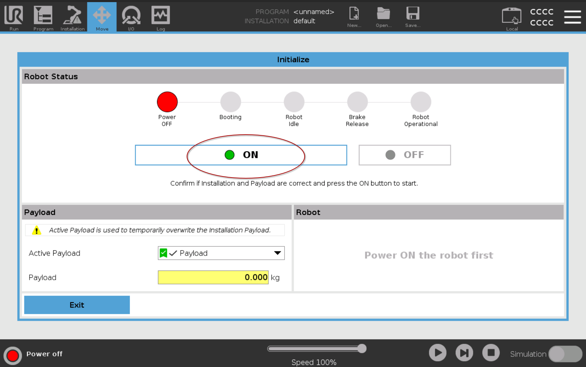
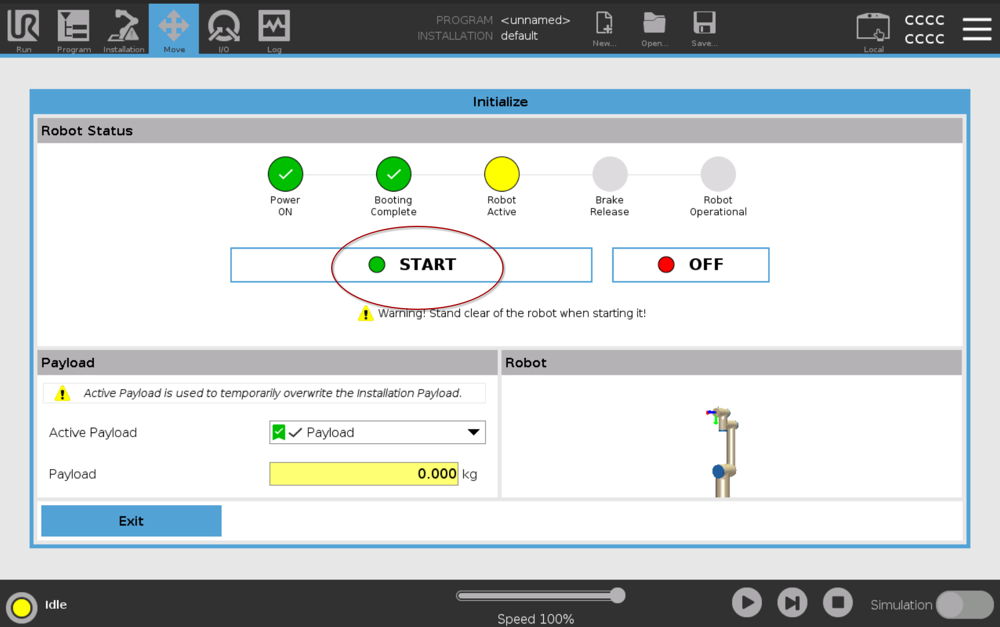
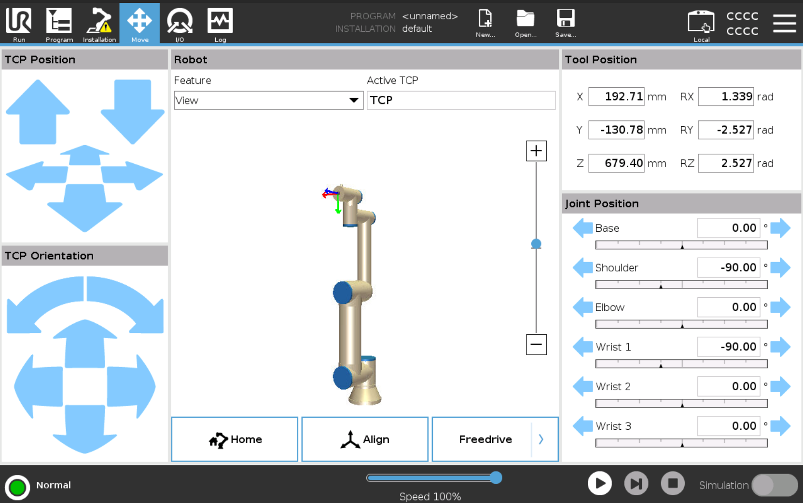
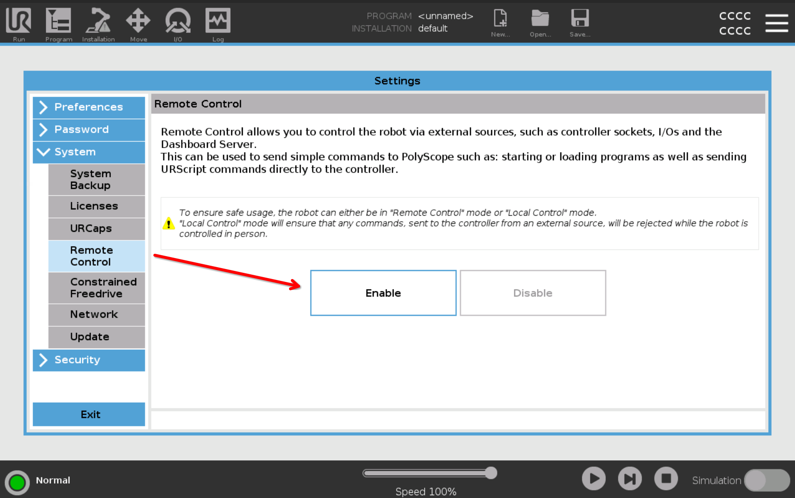
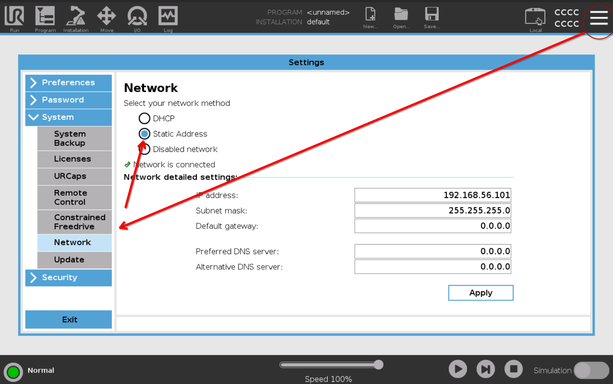
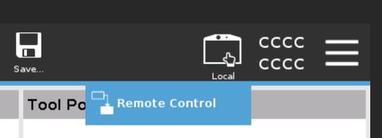

# UR Robot Setup

This guide covers the UR-specific steps for configuring the RTDE communication. This configuration is essential for enabling real-time communication between the robot controller and the b»Controlled Box

## 1. Power on and start the robot




## 1. Power on and start the robot

Lead the robot to the deafult "home" position. This is necessary for testing Joint Trajectory Controller with ROS2

```
positons: [0, -90, 0, -90, 0, 0]
```



## 1. Set up Remote Control

To set up remote control, we first need to enable it by navigating to the hamburger menu in the top right corner and selecting `System -> Remote Control`



### Robot network IP

Here we set the IP address where the robot responds to, this is the designated robot ethernet port on the CtrlX device.

In this image, we're connecting to UR sim at `192.168.56.10`, but you put in your CtrlX IP for the robot.


Lastly, exit the menu and toggle remote control ON



## Next Steps

The UR robot is now configured. Proceed to the [Commissioning PC Setup](../SETUP_COMMMISSIONING.md) to launch the ROS 2 environment and start controlling the robot.