# UR Robot Setup

This guide covers the UR-specific steps for configuring the RTDE communication. This configuration is essential for enabling real-time communication between the robot controller and the b»Controlled Box.

This guide is split between **Polyscope 5** and **Polyscope X**, as they have different UI.

# [Polyscope 5](https://www.universal-robots.com/products/polyscope-5/)

### 1. Power on and start the robot

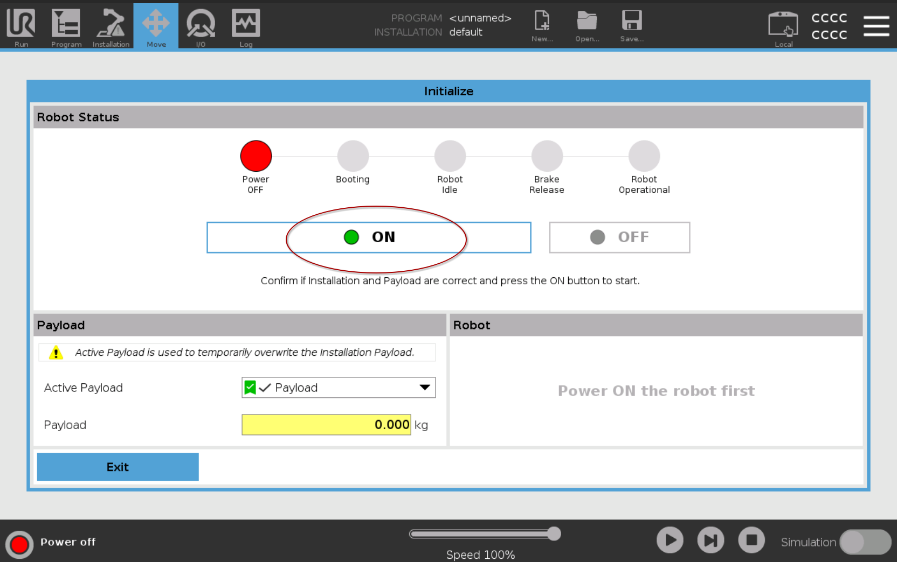
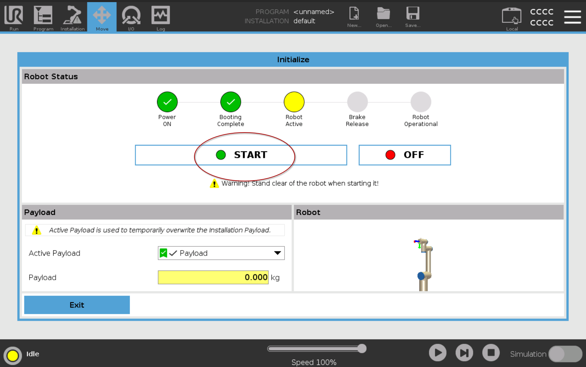

### 2. Set up Remote Control

To set up remote control, we first need to enable it by navigating to the hamburger menu in the top right corner and selecting `System -> Remote Control`

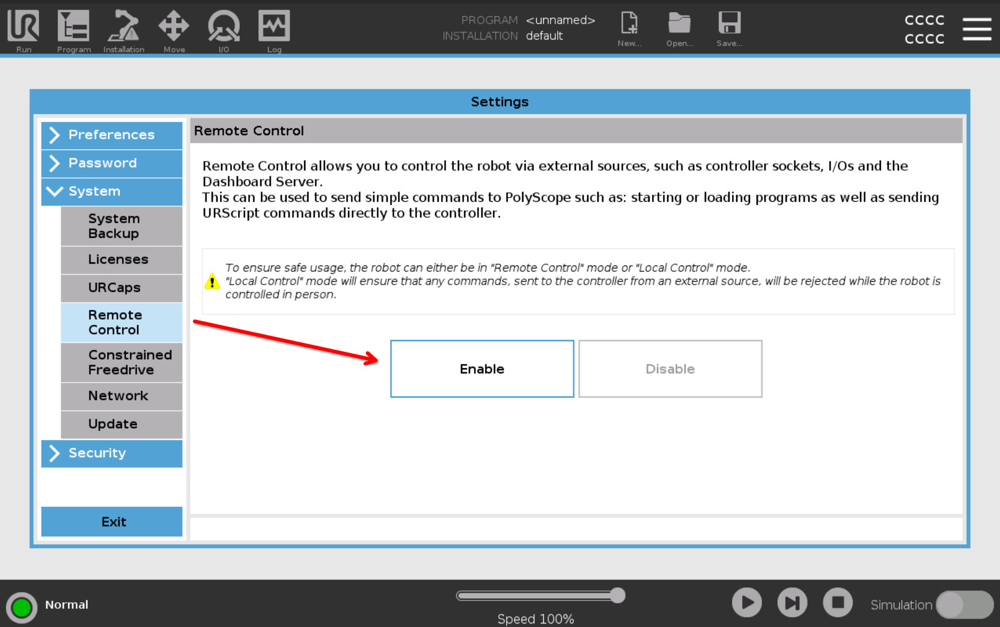

### 3. Robot network IP

Here we set the IP address where the robot responds to, this is the designated robot ethernet port on the CtrlX device.

In this image, we're connecting to UR sim at `192.168.56.10`, but you put in your CtrlX IP for the robot.
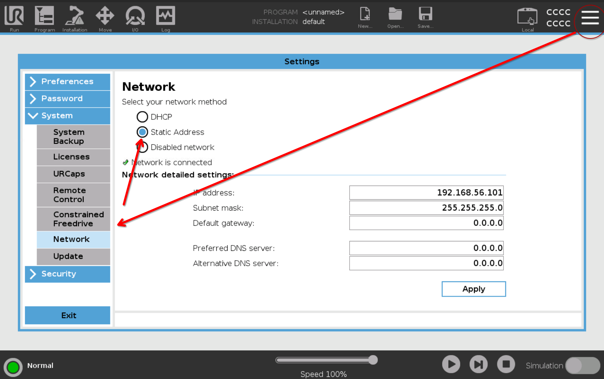

Lastly, exit the menu and toggle remote control ON

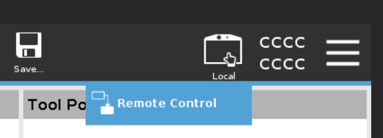


# [Polyscope X](https://www.universal-robots.com/products/polyscope-5/)

### 1. Power on and start the robot

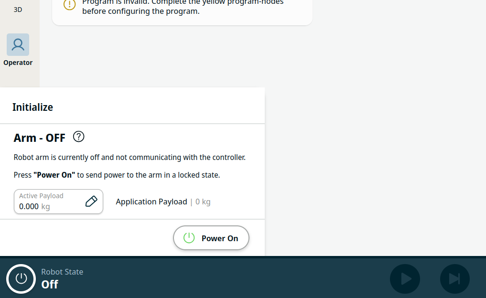
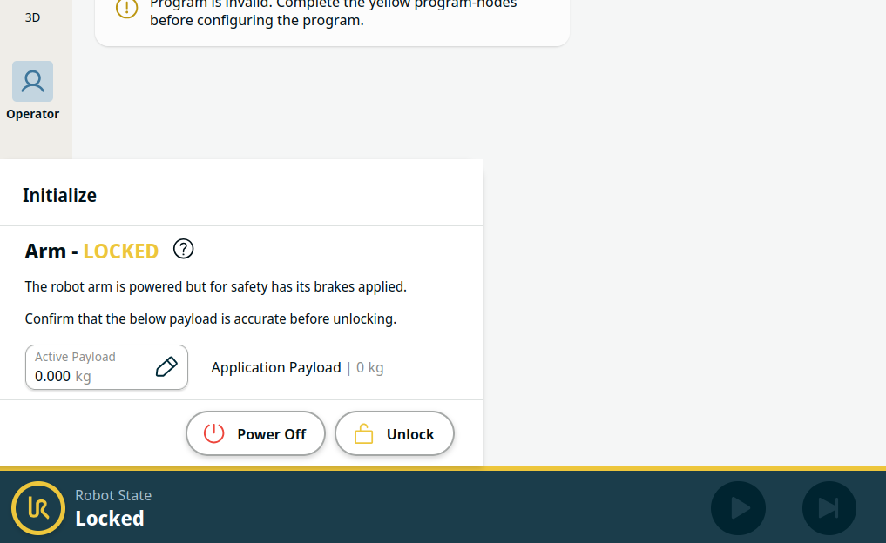

### 2. Set up RTDE communication

To set up remote control, we first need to enable it by navigating to the hamburger menu in the top left corner and selecting `Settings -> Security -> Services`.

There we enable three services:
- Primary Client Interface
- Secondary Client Interface
- Real-Time Data Exchange (RTDE)

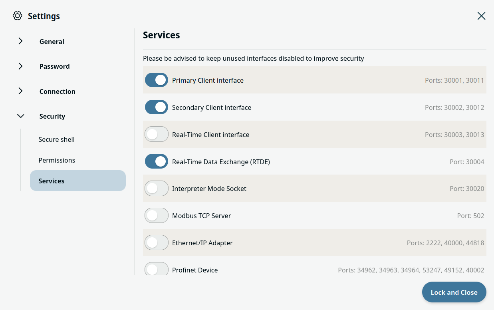

### 3. Robot network IP

> ***Note:** If you're using Polyscope X UrSim for simulation testing, you don't need to adjust this IP. Just note that the IP of your simulated robot will be the IP address of the container itself.* 

Here we set the IP address on which the robot can be reached

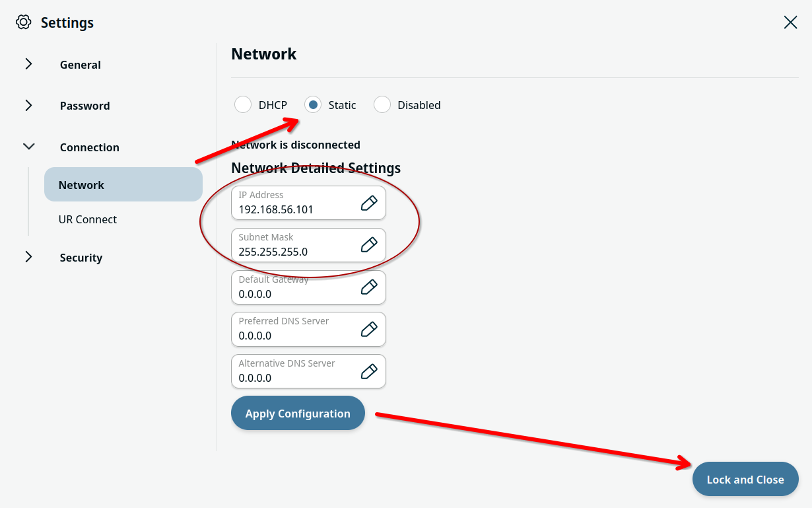

Additionally, we have to configure on which IP address will the robot respond to. This will **be the address of our CtrlX device!**.

You can find this setting in the top left corner by clicking `Application -> UR+ -> External Control`.

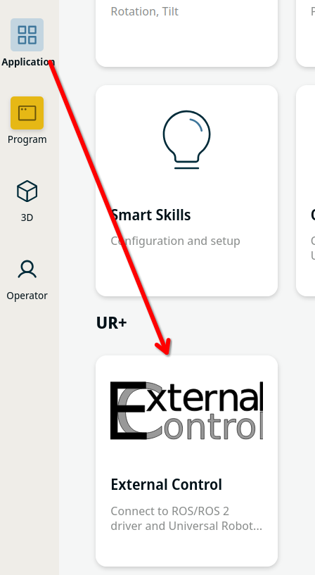

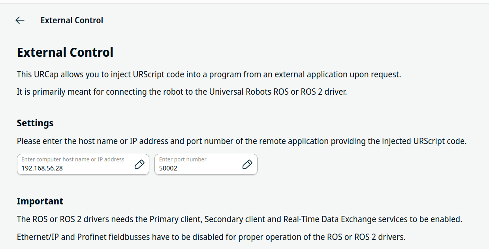

### 4. Set the robot in automatic mode

Lastly, when the network is configured and the robot is powered on and unlocked, set it to **AUTOMATIC** mode.

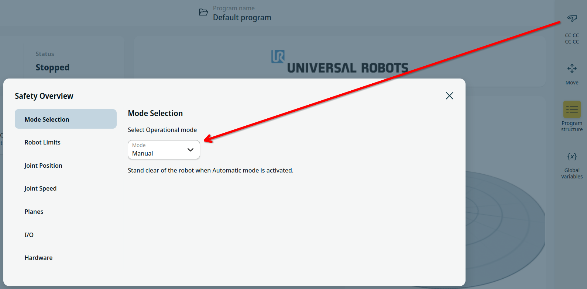


# Next Steps

The UR robot is now configured. Proceed to the [Commissioning PC Setup](../SETUP_COMMMISSIONING.md) to launch the ROS 2 environment and start controlling the robot.


## Notes on using `URsim` with CtrlX

Here are some notes and guidelines for setting up **UR simulator** to control it with CtrlX.

### Install container:

```bash
curl -O https://raw.githubusercontent.com/UniversalRobots/Universal_Robots_Client_Library/refs/heads/master/scripts/start_ursim.sh
chmod +x start_ursim.sh
# -v 10+ for polyscope X, version 5+ for polyscope 5
./start_ursim.sh -m ur3e -v 10.8.0 
```

### Passwords:
Access the Polyscope X UI. If prompted, the default passwords are:

    operator

    easybot

    ursafe

### Configure UR sim

First, configure the URsim, either Polyscope5 or PolyscopeX as shown above.

### Docker network workaround

The tricky part of controlling URsim via CtrlX is connecting it through the Docker firewall, as it comes with several layers of isolation with regards to traffic coming from outside.

**The final goal is to be able to ping URsim container IP address from CtrlX.** Then all else should work.

Here are some notes that helped us, and might point you in the right direction:

> You only need to run this once per session. It applies system-wide but does not persist between reboots.

```bash
# 1. Force traffic to CtrlX out the physical port
# Tells the host that traffic destined for the CtrlX must exit the physical 
# ethernet interface immediately, bypassing the internal Docker bridge.
sudo ip route add <CTRL_IP>/32 dev <PHYSICAL_INTERFACE>

# 2. Enable routing and proxy ARP
# When CtrlX asks the network "who has <CONTAINER_IP>?", the container cannot 
# hear it. This allows the host machine to intercept the request, reply "I do!", 
# and route the traffic internally to the container.
sudo sysctl -w net.ipv4.ip_forward=1
sudo sysctl -w net.ipv4.conf.all.proxy_arp=1

# These rules below can be seen by running:
sudo iptables-save

# 3. Allow traffic into the container via DOCKER-USER chain
# Docker actively prevents external traffic from being forwarded into containers. 
# This inserts a rule to explicitly accept traffic heading toward the simulator.
sudo iptables -I DOCKER-USER 1 -d <CONTAINER_IP> -j ACCEPT

# 4. Remove Docker's strict RAW drop rules
# The container automatically adds strict DROP rules for packets destined for RTDE 
# ports that didn't originate from the Docker bridge. This deletes that blockade.
sudo iptables -t raw -D PREROUTING -d <CONTAINER_IP>/32 ! -i <DOCKER_BRIDGE> -j DROP
```